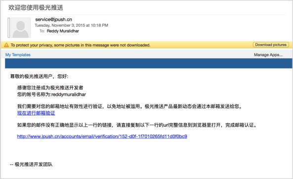
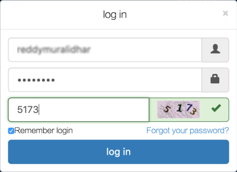

                           

Creating JPush Account and an Android Application in the JPush Console
======================================================================

This section explains how to create an account with JPush and create an Android application in the JPush console.

1.  In a browser, type [http://jpush.cn](http://jpush.cn/). Click Register to begin the registering a new user.
    
    
    
2.  Enter the username and password to be associated with the account. Click **I agree, Register** now to create the account.
    
    
    
3.  In the next screen enter the user name, company name, email address, and phone number.Click **Complete registration** to finish the registration process.
    
    
    
4.  Click the link that is provided in the verification email to activate the account.
    
    
    
5.  Log in to the JPush console using the account that was just created to create a new application.
    
    
    
6.  6\. Once logged in, click **Creating Applications** on the left.
    
    
    
7.  Enter the Application Name and Application Package Name for Android applications. For iOS applications, enter the development or the production certificate.
    
    
    
8.  Click Create my Applications to create the application.
    
    
    
    > **_Note:_** The AppKey and MasterSecret of the application created in the screen below will be used to configure the application for JPush in the Engagement Services server. Also clicking the Download Android Example will download a sample application that can receive JPush messages for the configured application.
    
    
