                            

Generating Firebase Cloud Messaging (FCM) Credentials
=====================================================

Generating Firebase Cloud Messaging (FCM) Server Key and Sender ID for Android Devices
-----------------------------------------------------------------------------------------

The first step in the installation and configuration of the sample Engagement application on an Android device is the generation of the sender ID. Android devices use the sender ID to register with FCM and receive notifications.

1.  Open the Google developer's console window by logging into: [https://console.firebase.google.com/](https://console.firebase.google.com/)
    
    The **Google Developer’s** account **Sign in** page appears.
    
    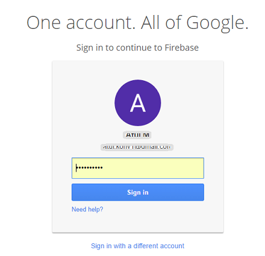
    
2.  Enter your Google credentials. Click **Sign in** to continue.
    
    The **Welcome to Firebase** page appears.
    
    
    
3.  Click **Create New Project**.
    
    The **Create a project** dialog box appears.
    
    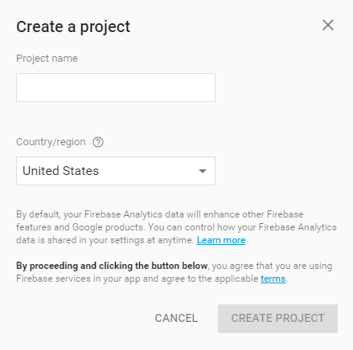
    
4.  Enter details for the following fields:
    
    *   **Project name**: Enter the project name. Based on the project name, the system generates the project ID. The project name is used in the Google console and the project ID identifies the project name.
    *   **Country/region**: Select the required country from the drop-down list.
    
    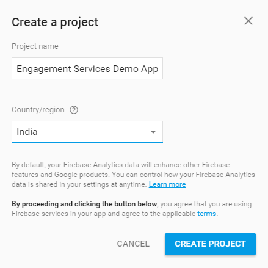
    
5.  **Cancel**: Click **Cancel** to close the **Create a project** dialog box.
6.  Enter the required details. Click **Create Project** to continue.
    
    The **Welcome to Firebase! Get started here** page appears.
    
7.  Click the wheel icon next to the **Engagement Services Demo App** label in the left menu bar.
    
    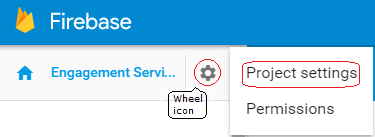
    
    The **Project settings** drop-down list appears.
    
    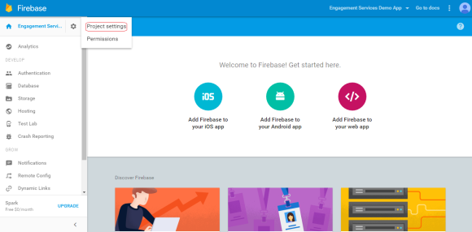
    
8.  Click **Project Settings** from the drop-down list.
    
    The **Settings** page appears. Here you can view the **Project name**, **Public**\- **facing name**, **Project ID**, and the **Web API Key** for your reference.
    
    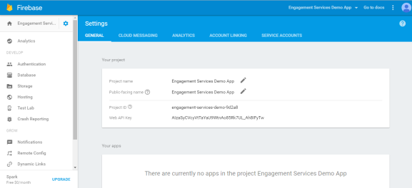
    
    You can edit the **Project name** and the **Public**\-**facing name**.
    
9.  Under **Settings**, click the **Cloud Messaging** tab next to the **General** tab.  
    The **Project credentials** section appears. The **Project credentials** section displays the **Firebase Cloud Messaging** token, **Sender ID**, and the **Server key**.
    
    
    
10.  Copy the **Sender ID**. You use the **Sender ID** in the client-side application to register to FCM from the device.
11.  Copy the **Server Key**. You use the **Server Key** in the Engagement server while creating an application

Creating FCM Project URL and Generating Service Account Key for Android Device
--------------------------------------------------------------------------------

The first step in the installation and configuration of the sample Engagement application on an Android device is the generation of the sender ID. Android devices use the sender ID to register with FCM and receive notifications.

1.  Open the Google developer's console window by logging into: [https://console.firebase.google.com/](https://console.firebase.google.com/)
    
    The **Google Developer’s** account **Sign in** page appears.
    

    

    
2.  Enter your Google credentials. Click **Sign in** to continue.
    
    The **Welcome to Firebase** page appears.

    
    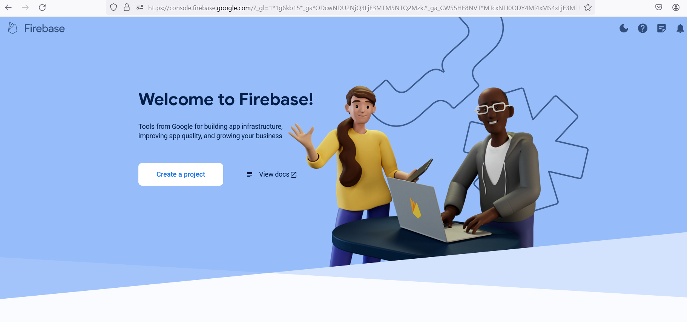

    
3.  Click **Create New Project**.
    
    The **Create a project** dialog box appears.

    
    

    
4.  Enter details for the following fields:
    
    *   **Project name**: Enter the project name. Based on the project name, the system generates the project ID. The project name is used in the Google console and the project ID identifies the project name.

    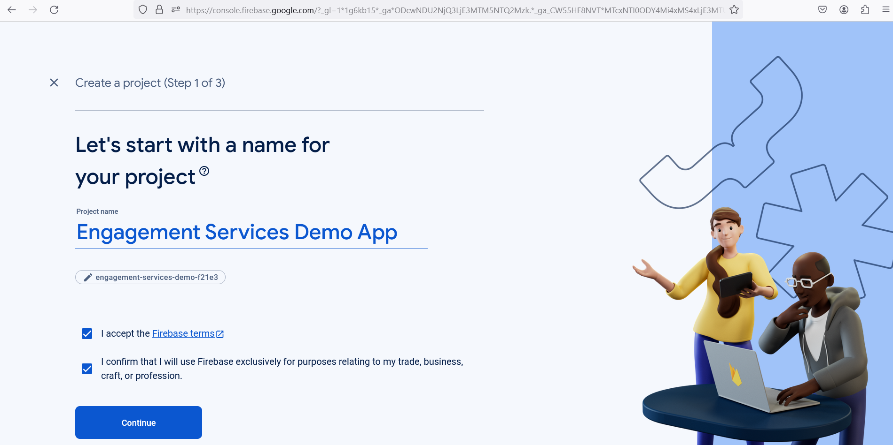

    *   **Country/region**: Select the required country from the drop-down list.
    

    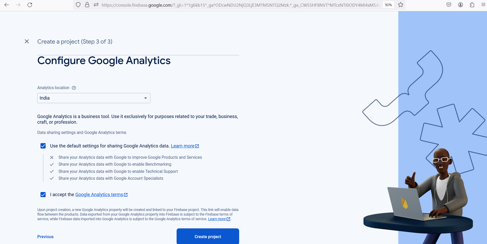

    
5.  **Cancel**: Click **Cancel** to close the **Create a project** dialog box.
6.  Enter the required details. Click **Create Project** to continue.
    
    The **Welcome to Firebase! Get started here** page appears.
    
7.  Click the wheel icon next to the **Engagement Services Demo App** label in the left menu bar.
    

    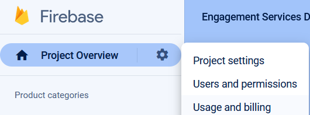

    
    The **Project settings** drop-down list appears.

    
    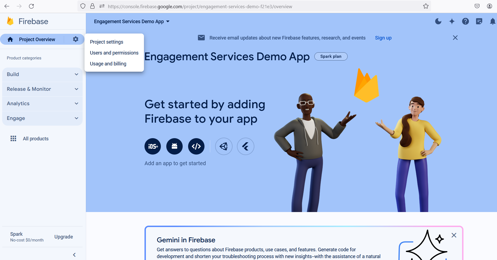

    
8.  Click **Project Settings** from the drop-down list.
    
    The **Project Settings** page appears. Here you can view the **Project name**, **Project ID**, **Project Number** and the **Web API Key** under **General** tab for your reference.
    

    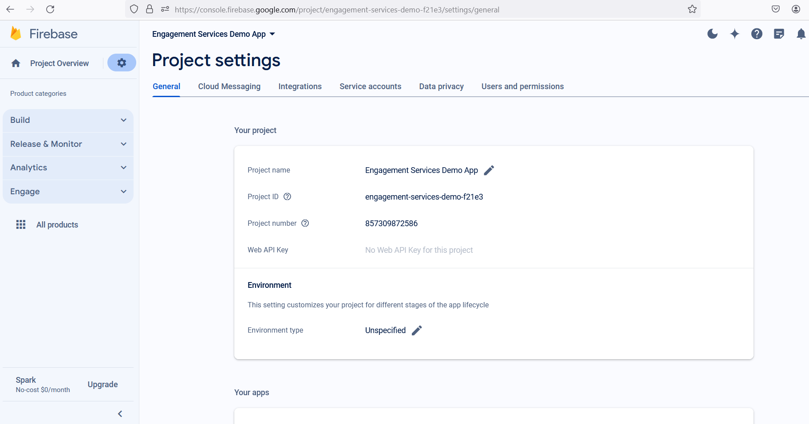

    
    You can edit the **Project name**.
    
9.  Under **Project Settings**, click the **Service Accounts** tab next to the **Integrations** tab.  
    The **Firebase admin SDK** section appears. Here Select the Language as Java and Generate the Service_Account_Key.json file by clicking Generate new private key
    

    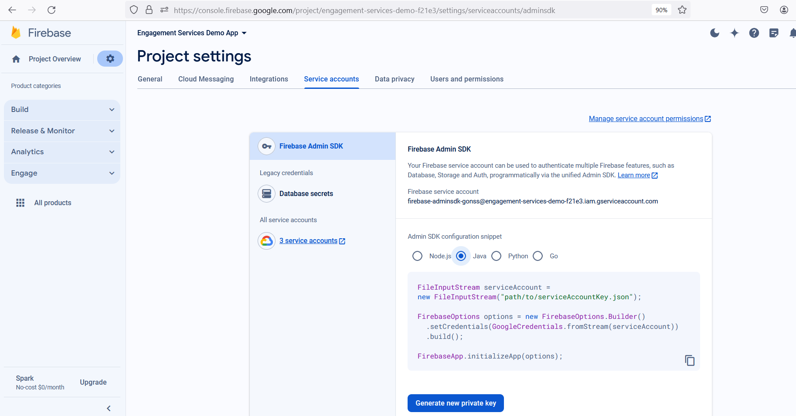
    
    
10.  Copy the **Project ID**. You use the **Project ID** in the client-side application to register to FCM from the device.
11.  Copy the **Service_Account_Key.json**. You use the **Service_Account_Key.json** in the Engagement server while creating an application.