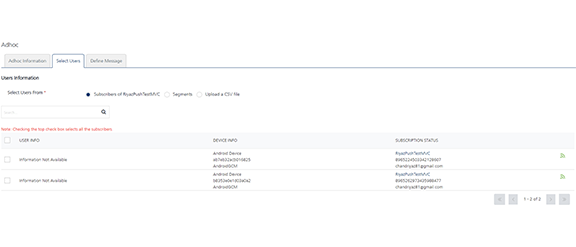

                            

Sending Adhoc Email, SMS and Push Notifications
===============================================

The section explains how to set up the demo application on the Android device to receive ad hoc push, email and SMS messages after the subscription is complete. Details of configuring a segment are also provided.

Configuration of a Segment:
---------------------------

The section describes the execution steps needed to create a segment. You can use the segment to send ad hoc email, SMS and push notifications.

1.  Under **Engagement**, click **Segments** in the left pane to display the **Segments** home page.
    
    The **Segments** home page appears.
    
2.  On the **Segments** page, click the **Add Segment** button.
    
    
    
    The **Add Segment** page appears. The **Add Segment** page includes the two sections: **Segment Information** and **Define Conditions**.
    
3.  In the **Segments Information** section, enter the details for the following fields:
    *   **Name** (mandatory): Enter a name for the segment that you want to define. Your segment name should include alphanumeric characters only.
    *   **Owner**: The field is populated automatically with the segment owner's name.
    *   **Created Date**: The field is populated automatically with the system's current date and the current time.
        
        
        
4.  In the **Define Conditions** section, do the following:
    
    The **Define Conditions** list-view contains the following fields:
    
    1.  **Conditions**: Click **Add** to add a new condition row. A new condition is added with a number under the **Conditions** column in the grid.  
        The condition numbers are the references to the user attributes that are associated with that condition. The numbered conditions can be used to define different combinations for a segment definition.
    2.  **Attributes**: Under the **Attributes** column, select the attribute from the drop-down list. You can select any user attributes as required. For example, **First Name**, **Last Name**, **Email**, **Mobile Number**, **Country**, **State**, **Location**, **Beacon**, **Last Active Date**, and any dynamic user attribute type.
    3.  **Operator**: Under the **Operators** column, select the required operator from the drop-down list. You compare a user attribute with a value by using a specified operator such as **Contains**, **Equal**, or **NotEqual**. The following table describes operators to define a segment.
        
        | Operator | Description |
        | --- | --- |
        | Contains | The operator checks if the attribute value for all users have a common substring given in the value field |
        | Equal | The operator checks if both operands have the same value |
        | NotEqual | The operator checks if both operands do not have the same value |
        | GreaterThan | The operator checks if the value of the left-hand operand is greater than the value of the right-hand operand |
        | LessThan | The operator checks if the value of the left-hand operand is less than the value of the right-hand operand |
        | GreaterThan CurrentDate + {days} | The operator checks if the date value of the attribute is greater than the current date plus number of days specified in the value field |
        | GreaterThan CurrentDate - {days} | The operator checks if the date value of the attribute is greater than the current date minus number of days specified in the value field |
        | LessThan CurrentDate + {days} | The operator checks if the date value of the attribute is lesser than the current date plus number of days specified in the value field |
        | LessThan CurrentDate - {days} | The operator checks if the date value of the attribute is lesser than the current date minus number of days specified in the value field. |
        
    4.  **Value**: Helps you configure values for conditions. Enter the value in the **Value** field. For example, you may want to create a condition with users whose first letter in the name contains 'a' character such as Albert, Anna, and Alex.
    5.  **Execute Conditions by**: Select the required condition from the drop-down list to use for segment definition.
        
        
        
5.  If you select the execute condition as **Match all conditions** or **Match any condition**, based on the fulfilled condition(s), the system inserts the number of users under the **Users** column.
6.  If you select the executive condition as **Advanced**, five logic buttons appear. Based on your requirement, select the logical operators.
7.  Click the **Validate** button.
8.  The system displays the confirmation message, if the logic is correct. It states that the validation is successful. Click **OK** to continue. The system displays the **Add Segment** screen.
    
    The number of added users appear under the **Users** column.
    
    
    
9.  Click **Save** to save the segment. The system adds the new segment in the segments' grid on the **Segments** screen. The system displays the confirmation message that the segment is saved successfully.
    
    
    

Sending Adhoc Push Notifications
--------------------------------

The ability to send push notifications is one of the most important features of Engagement services. The push message feature lets you configure and send push messages based on the preferences and personalization attributes for targeted subscribers or segments. Push messages are sent only to subscribed apps that are active and installed on mobile devices.

### Sending Adhoc Push Notifications to Subscribers

The section describes how to configure push notifications and send them to individual subscribers.

1.  From the **Engagement** section, click **Adhoc** from the left panel. The **Adhoc** screen appears with three tabs: **Adhoc Information**, **Select Users** and **Define Message**. By default, the **Adhoc Information** tab is set to active.
    
    
    
2.  **Select Channe**l: Select the **Push Message** channel from the drop-down.
    
    The **Select Application** drop-down appears.
    
3.  Select the required application from the drop-down list.
    
    
    
    Push Messages are sent only to configured platforms with an app.
    
4.  **Send Message**: Select the option as **Now** or **Later**. By default, the option is set to **Now**.
5.  Click the **Next -Select Users** button to continue. The **Select Users** tab becomes active.
    
    
    
    Select the option as **Segments** or **Subscribers**. Based on selected app, the list-view populates with the details of associated subscribers.
    
    
    
6.  Select the number of subscribers from the list-view and click **Next - Define Message** to continue.
    
    The **Define Message** tab becomes active.
    
    
    
    The **Define Message** page includes **Message Information** section to add a new push message. The **Message Type** field includes two options to add a new push message:
    
    *   Silent Push
    *   Standard Push
    
    By default, the message type option is set to standard push.
    
7.  In the **Push Message** section, enter the message title and the push message in the **Message Box**. If required, select the personalization attributes.
8.  **Associate Rich Push**: Select the checkbox, if you want to associate the rich push. To customize your text, you can use the **Rich Text Editor** tool bar available at the top of **Rich Content** box.
9.  **Silent Push**: When you check the **silent push** option, the system displays platform specific properties fields only. This is because the **Message Title** and the **Message Text** fields are not applicable for silent push.
10. Click **Send** to deliver the push message immediately.
11. Click the **API Payload** button to get details of the API call that can be used by a third party system to send notifications.
12. Choose the **Later** option on **Adhoc Information** screen to schedule the message delivery at a later day and time.
13. Select the **Start Date and Time** and the **Expiry Date and Time**.
14. Click **Schedule Notification** to schedule the message delivery later.
    
    
    

### Sending Adhoc Push Notifications to Segments

The section describes how to configure push notifications for segments (group of subscribers).

1.  **Select User From**: Select the option as **Segment** in the **Define Message** screen. The **Select Users** list-view appears.
    
    
    
2.  Click the **Select a Segment** drop-down list below the **Select Users** list-view to select the required segments.
    
    
    
3.  The selected segment with associated users appears in the list-view.
    
    
    
4.  Click **Next Define Message** to continue. The **Define Message** screen appears.
    
    
    
5.  In the **Message** section, enter the **Title** and **Message** for the push notification.
6.  Choose **Now** on **Adhoc Information** page to send push message immediately. Click **Send.**
7.  Choose the **Later** option to schedule the message delivery at a later day and time.
8.  Select the **Start Date and Time** and **Expiry Date and Time**. Click **Schedule Notification** for the message delivery to be scheduled for later.
    
    
    

Sending Adhoc Email Notifications
---------------------------------

The Email Message feature allows you to configure and send email messages based on the preferences and personalization attributes for the targeted users or segments.

### Sending Adhoc Email Notifications to Audience Members

1.  From the **Engagement** section, click **Adhoc** from the left panel. The **Adhoc** screen appears with three tabs: **Adhoc Information**, **Select Users** and **Define Message**. By default, the **Adhoc Information** tab is set to active.
2.  **Select Channel**: Select the **Email Message** channel from the drop-down list.
    
    
    
3.  Click **Next- Select Users** to continue.
    
    The **Select User** screen tab becomes active. The **Select Users** screen displays all the users in the list-view. By default the **To** option is set to **Users**.
    
    
    
4.  In the **User Information** section, there is an option to choose **Users** or predefined **Segments** in the **TO**, **CC** and **BCC** sections of the email. Choose users to whom the email notifications are to be sent.
    
    
    
5.  Click **Next -Define Message** to continue. The **Define Message** tab becomes active.
6.  Type the **Sender Name**, **Sender Email** information in the corresponding fields at the end of **Defining Message Target** section.
    
    > **_Note:_** Choose the **Send to Me** option if the sender needs to be copied on the email or the **Send Copy to Others** option if a copy of the email needs to be sent to multiple email addresses.
    
    
    
7.  Next, in the **Email Message** section, compose a new email message along with the email subject as shown below.  
    You can use the rich text editor available at the top of the message box to customize the email text.
    
    
    
8.  Click the **View API Payload** button to view the API payload.
9.  Click **Send** to continue.
10. Choose the **Later** option on the **Adhoc Information** screen to schedule the message delivery at a later day and time.
11. Select the **Start Date and Time** and **Expiry Date and Time**.
12. Click **Schedule Notification** for the message delivery to be scheduled for later.
    
    
    

### Sending Adhoc Email Notifications to Segments

The steps involved to send the adhoc email notifications are similar to sending adhoc push notifications to segments.

Sending Adhoc SMS Notifications
-------------------------------

The SMS message feature allows you to configure and send SMS messages based on the preferences and personalization attributes for the targeted audience members or segments.

1.  From the **Engagement** section, click **Adhoc** from the left panel. The **Adhoc** screen appears with three tabs: **Adhoc Information**, **Select Users** and **Define Message**. By default, the **Adhoc Information** tab is set to active.
2.  **Select Channel**: Select the **SMS Message** channel from the drop-down list.
    
    
    
3.  Click **Next- Select Users** to continue.
    
    The **Select Users** tab becomes active. The **Select Users** screen displays all the users in the list-view. By default the **To** option is set to **Users**.
    
    
    
4.  Select the user to send the text message from the list-view.
5.  Click **Next - Define Message** to continue. The **Define Message** tab becomes active.
6.  In the **Message** section, type the message in the message box.
    
    
    
7.  Click **Send** to continue.
8.  Choose the **Later** option on **Adhoc Information** screen to schedule the message delivery at a later day and time.
9.  Select the **Start Date and Time** and **Expiry Date and Time**.
10. Click **Schedule Notification** to schedule message delivery later.
    
    
    
    | Rev. | Author | Edits |
    | --- | --- | --- |
    | 8.0 | AU | AU |
    | 7.2.5 | AU | AU |
