                           

Demo App QuickStart Guide (Building a Sample App – iOS): Generating an Apple Push Notification Service (APNS) Certificate

Generating an Apple Push Notification Service (APNS) Certificate
================================================================

The Apple Push Notification Service (APNS) certificate is needed for the iOS devices to register with Apple to receive notifications.

**To generate an Apple Push Notification Service (APNS) certificate, follow these steps**:

The first step to generate an Apple Push Notification Service (APNS) certificate is to generate a certificate request (CSR) file. The certificate request (CSR) file is used to request a development SSL certificate.

1.  To generate a `CSR file`, launch the **Keychain Access** application from the **LaunchPad**.
    
    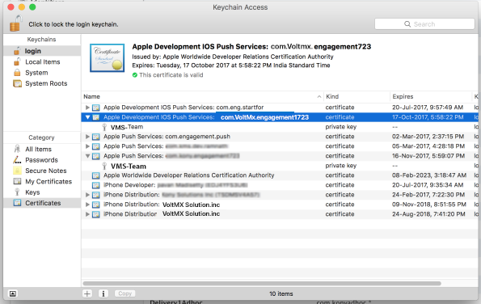
    
2.  Select the **Keychain Access** > **Certificate Assistant** > **Request a Certificate From a Certificate Authority ...** to create a SSL certificate.
    
    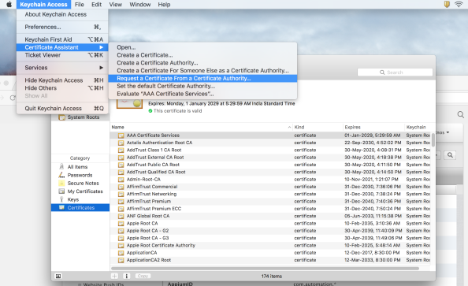
    
    The **Certificate Assistant** window appears.
    
3.  Under the **Certificate Information** section enter the following details:
    *   **User Email Address**: Enter your email address.
    *   **Common Name**: Enter the common name.
    *   **Request is**: Select the option as **Saved to disk**.

    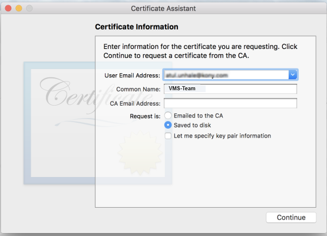
    
4.  Click **Continue** to proceed. The **Save As** dialog box appears.
5.  **Save As** dialog box: Change the file name extension in the **Save As** field to .`CSR` and click **Save**.
    
    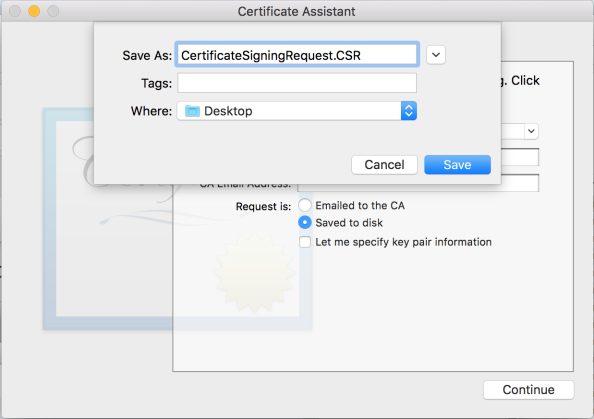
    
6.  Click **Continue** to proceed. The **Conclusion** notification appears.
7.  Click **Done** to create the CSR request and save it on your computer.
    
    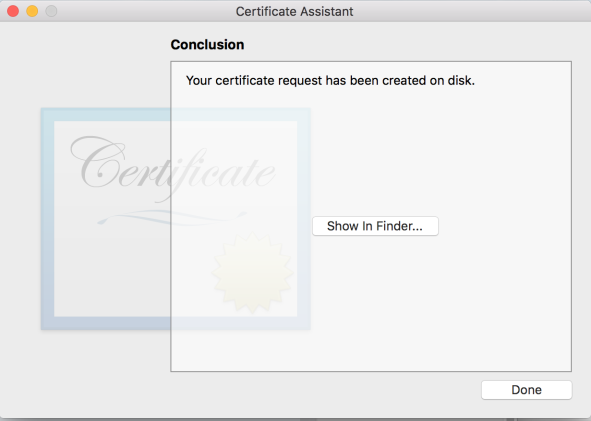
    
8.  Log on to the [developer.apple.com](http://developer.apple.com/) site with your Apple credentials. If you do not have an Apple developer’s account, register with Apple.
    
    
    
9.  Click **Sign In** to continue.
10. The next step is to create an app ID for push notifications. On the **Developer Account** page, click **Certificates, IDs and Profiles** in the left pane to continue.
    
    The **Certificates, Identifiers and Profiles** page appears.
    
    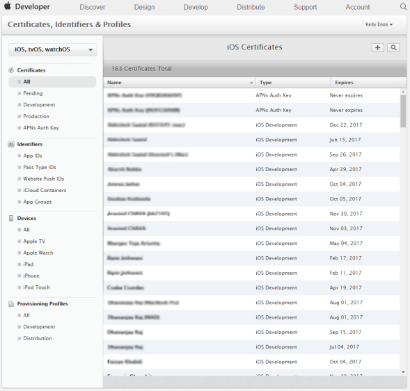
    
11. Click **App IDs** under **Identifiers** in the left pane to add a new **App ID**. The **iOS App IDs** page appears with a list-view of existing **App IDs.**
    
    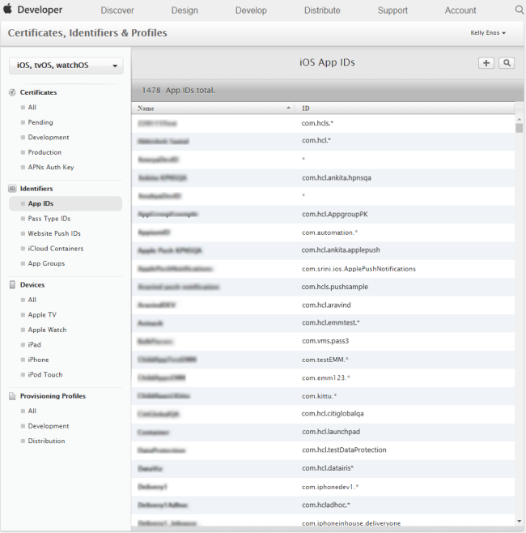
    
12. Click the plus sign next to the label **iOS App IDs**. The **Register iOS App ID** page appears.
13. **Register iOS App ID**: Enter the details for the following fields:
    *   **App ID Description**:
        *   **Name**: Enter the application name.
    *   **App ID Suffix > Explicit App ID**:
        
        *   **Bundle ID**: Enter the bundle Id. Remember the bundle Id as it is used to configure the application in Iris.
        
        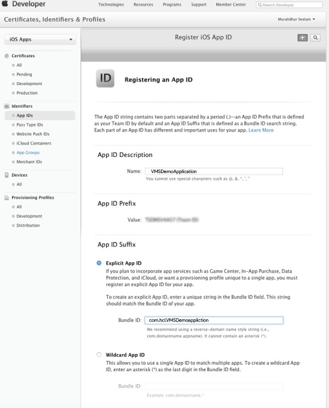
        
14. Ensure that **Push Notifications** is checked under the **App Services** section. Click **Continue** to proceed.
    
    
    
    The **Confirm your App ID** section appears.
    
15. The **Confirm your App ID** screen displays the details of the **App ID** that will be created. Click **Register** to continue.
    
    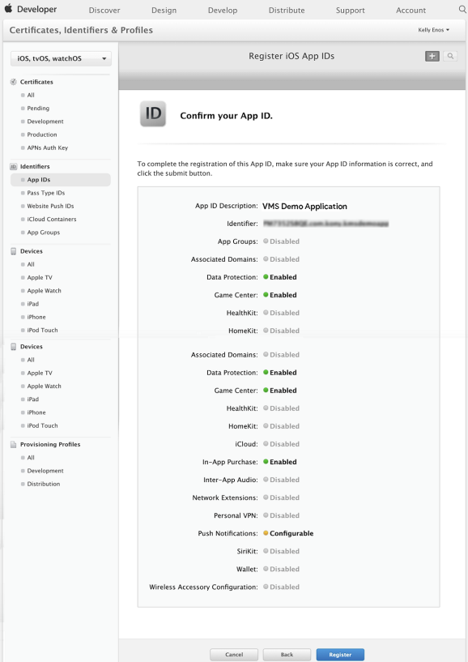
    
16. The system displays the message that the **App ID** is confirmed. Click **Done.**
    
    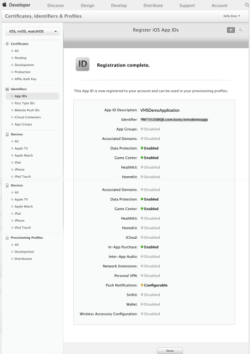
    
17. The next few steps discuss the configuration of the **app ID** for push notifications. Select the newly created app ID.
    
    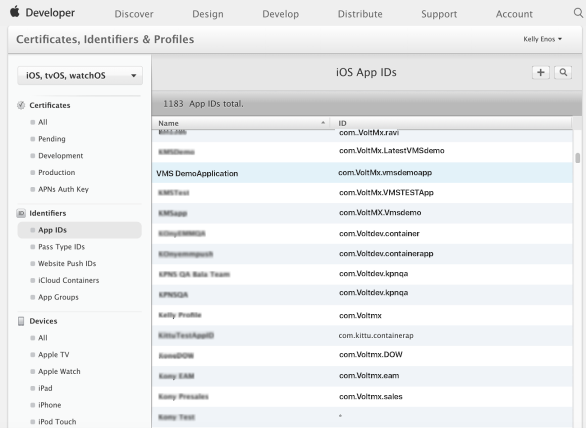
    
18. Click the application name (VMSDemoApplication in the example below) and click **Edit** to edit the information of the application ID chosen. (The **VMSDemoApplication** details to be continued)
    
    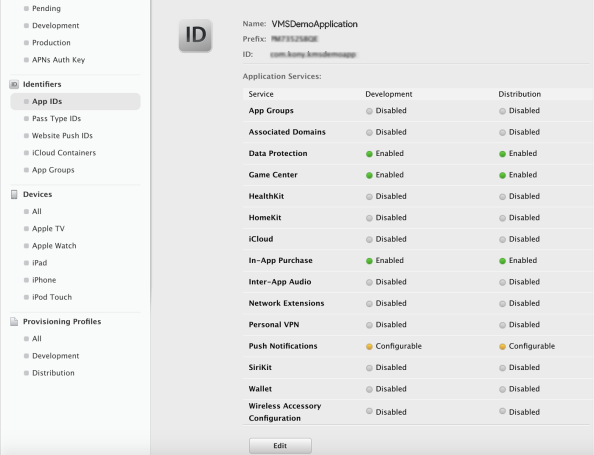
    
19. **VMSDemoApplication:** In **App ID Suffix** >**App Services** section, select the **Push Notifications** option to create the development and production certificates.
    
    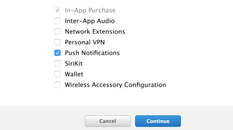
    
20. Click **Continue** to proceed.
21. **VMSDemoApplication:** To create a development certificate, click **Create Certificate** in the **Development SSL Certificate** section. Click **Done**.
    
    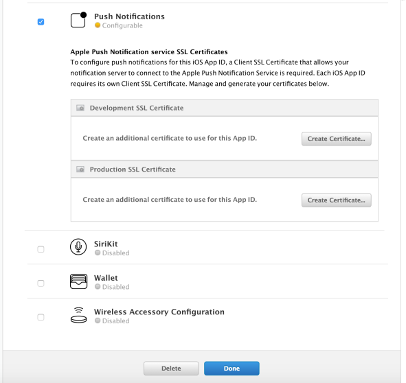
    
22. The screen below describes the steps to create the **Certificate Signing Request** (CSR) but as these steps are already complete, click **Continue** to move to the next step.
    
    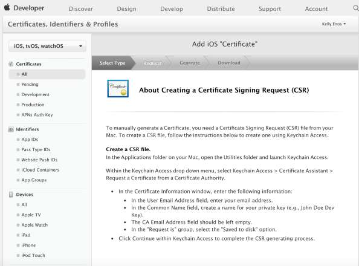
    
23. The **Generate your certificate** window appears. The next step involves choosing the **CSR** file that was generated earlier. Click **Choose File** to upload the .`CSR` file.
    
    
    
24. Click **Continue** after the `CSR` file is selected to complete the certificate creation.
    
    
    
25. The **Your certificate is ready** section appears. Select com.voltmx.vmsapplicationdemo and click **Download** to download the certificate.
    
    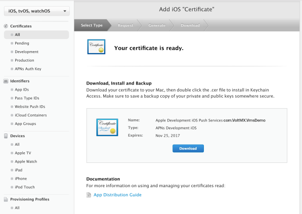
    
26. Double click aps\_production.cer in the **Downloads** folder to add it to the **Keychain Access** application.
    
    
    
27. To view the certificate in the **Keychain**, launch the **Keychain Assistant** and search by the certificates category. The push certificate is displayed.
    
    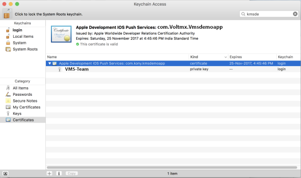
    
28. Right-click the certificate and click **Export Apple Production iOS Push Services:com.voltmx.vmsdemoapplication** from the drop-down list to export the certificate.
    
    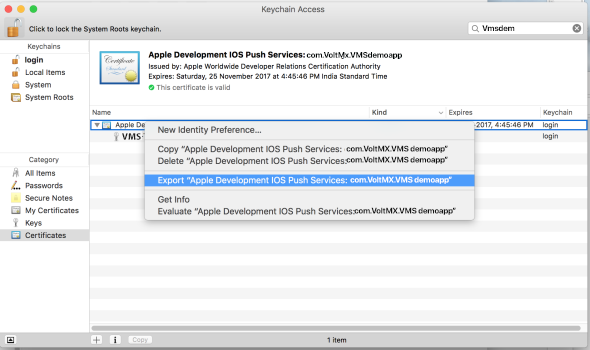
    
29. Enter the file name and the location where the file is to be saved and click **Save**.
    
    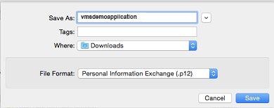
    
30. Enter the password and click **OK** to continue.
    
    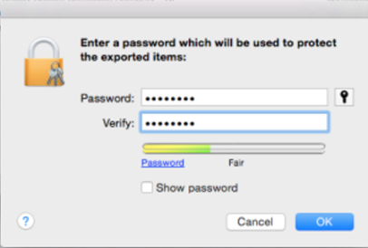
    
31. Enter your admin password for your computer and click **Allow**. This ensures that the certificate can be exported to the folder mentioned.
