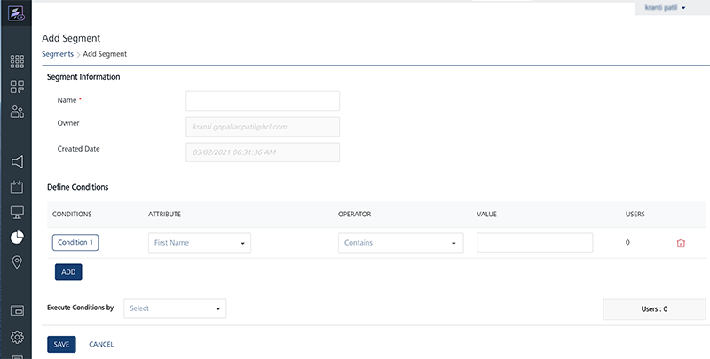
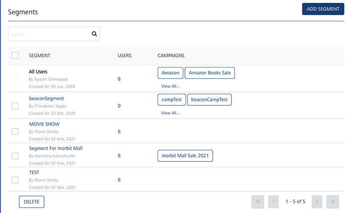
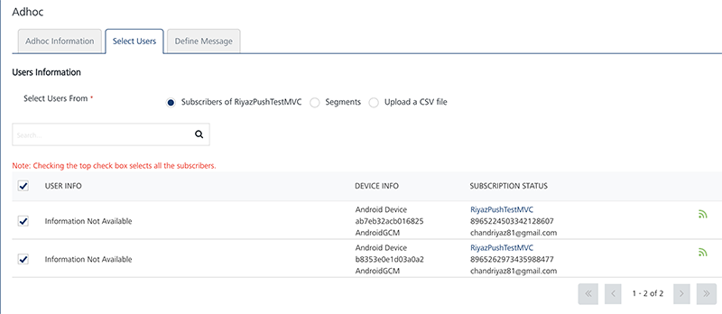
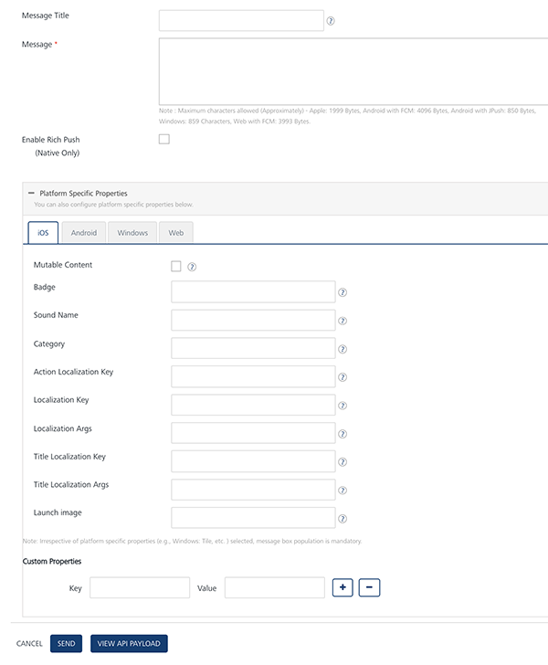
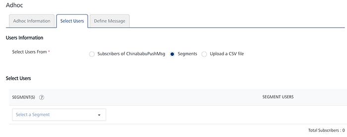

                            

Sending Ad hoc Email, SMS and Push Notifications
================================================

This section explains how the demo application on the iOS device can receive ad hoc push, email and SMS messages after the subscription is complete. Details of configuring a segment are also provided.

Configuration of a Segment:
---------------------------

This section describes the execution steps needed to create a segment, which will then be used to send Ad hoc email, SMS and Push notifications.

1.  Click the Segments that are contained in the Targeting section on the left.
    
    
    
2.  Click Add Segmentto display the screen to add a new segment.  
    Enter the name of the segment. The owner and created date are automatically populated.  
      
    
3.  Under the Define Conditions section, for condition no. 1, choose a first name for the user Attribute, Contains for the operator and type the first name of the user in the Value. In the sample below the first name is Muralidhar. As soon as the condition is defined and there are users that qualify the condition, the count is updated in the Users column.  
    Click on **Save** to save the created segment.
    
    Condition No. refers to the user attributes added in the grid that help to define conditional logic in the Segment Definition area.  
      
    
    
    
4.  After the segment is saved, the Segments page will all the segments along with the newly created segment is displayed.  
    
    

Sending Ad hoc Push Notifications:
----------------------------------

The ability to send push notifications is one of the most important features of messaging. The Push Message feature allows configuring and sending push messages based on the preferences and personalization attributes for the targeted subscribers or segments. Push messages are sent only to subscribed apps that are active and installed on mobile devices.

### Sending Ad hoc Push Notifications to Subscribers:

This section describes how to configure push notifications to be sent to the individual subscribers.

1.  Click **Adhoc** under **Engagement** section on the left side of the page. The Push Message option is selected by default in the Channel Type on the right side of the page. In the Published Applications dropdown of the Associated Applications section, choose the published application to which the notifications will need to be sent.  
      
    
2.  In **Define Message Target** section, choose **Subscribers** as Message Audience. This will show the list of the subscribers that are currently subscribed to the VMSDemo application. Select the subscribers to whom the push message will need to be sent.  
    
    
3.  In the **Message** Section, enter the Message Title and Message for the push notification to be sent. Choose the option **Now** in the **Set Start and Expiry Time** section to have the notification immediately sent. Click **Send**.  
    
    
4.  To have the message sent at a later day and time, choose the **Later** option in the **Set Start and Expiry Time** section. This allows the user to schedule the day and time when the push notification will need to be sent. After the day and time are chosen, click on **Schedule Notification**.  
      
    

### Sending Ad hoc Push Notifications to Segments:

This section describes how to configure the push notifications to be sent to the segments that are a group of subscribers.

1.  Click **Adhoc** under the **Engagement** section on the left. Select the Channel Type to be Push Message and choose the published application under the Published Applications. This lets you add segments associated to this application.  
      
    
2.  Under the **Define Message Target** section, as shown below, select **Segments**. Click + **Add Segments** to start adding the segments to which the notification has to be sent.
    
    
    
3.  In the **Add Segment(s)** to **Message** screen, select the segment from the Unassigned section and clickgreater than button as this will add the segment to the Assigned section. Click Save to save the segment.
    
    
    
4.  Once the segment is successfully added, the **Users** column will display the number of the users to qualify for the segment.  
      
    
5.  In the **Push Message Section**, enter the Message for the push notification to be sent. Choose **Now** in the **Set Start and Expiry Time** section for the message to be sent immediately. Click **Send**.  
    
    
6.  Choose the **Later** option in the **Set Start and Expiry Time** section. This allows to schedule the day and time when the push notification will need to be sent. After the day and time are chosen, click **Schedule Notification** to schedule the notification to be sent at a later day and time.  
      
    

Sending Ad hoc Email Notifications:
-----------------------------------

The **Email Message** feature allows the user to configure and send email messages based on the preferences and personalization attributes for the targeted subscribers or segments. Email messages are sent only to subscribed apps that are active and installed on mobile devices.

### Sending Ad hoc Email Notifications to Subscribers:

1.  Click Adhoc under **Engagement** section on the left side of the page. This will display the page as below. Select **Email Message** tab in the Channel Type on the right side of the page.  
      
    
2.  In the **Define Message Target** section, there is an option to choose Users or predefined Segments in the TO, CC and BCC sections of the email. Choose the users to whom the email notifications are to be sent.  
    
    
3.  Type the Sender Name, Sender Email information in the corresponding fields at the end of Defining Message Target section.
    
    > **_Note:_** Choose the Send to Me option if the sender needs to be copied on the email and SendCopy to Others option if a copy of the email needs to be sent to multiple email addresses.
    
    
    
4.  Next, in the **Message** section, compose a new email message along with the email subject as shown below.  Select Now in the Set Time section and click Send.
    
    
    
5.  To send the email at a later day and time, choose the **Later** option in the **Set Start and Expiry Time** section. This allows the user to schedule the day and time when the email notification will need to be sent. After the day and time are chosen, click **Schedule Notification** to schedule the notification to be sent at a later day and time.  
      
    

### Sending Ad hoc Email Notifications to Segments:

The steps involved to send the ad hoc email notifications are similar to sending ad hoc push notifications to segments.

Sending Ad hoc SMS Notifications:
---------------------------------

### Sending Ad hoc SMS Notifications to Subscribers:

The SMS message feature allows you to configure and send SMS messages based on the preferences and personalization attributes for the targeted subscribers or segments. SMS messages are sent only to subscribed apps that are active and installed on mobile devices.

1.  Click **Adhoc** under **Engagement** section on the left side of the page. Select SMS Message option in the Channel Type on the right side of the page.
    
    
    
2.  In the **Define Message Text** section, choose the User option. Select the user to send the text message to.  
      
    
3.  In the **Message** section, type the message in the message box and **Set Start and Expiry Time** to **Now**. Click **Send** to send the notification.  
      
    
4.  Choose the **Later** option in the **Set Start and Expiry Time** section. This allows you to schedule the day and time when the SMS notification will need to be sent. After the day and time are chosen, click **Schedule Notification** to schedule the notification to be sent at a later day and time.  
    
    
    
      
    

### Sending Ad hoc SMS Notifications to Segments:

The steps involved to send the ad hoc SMS notifications are similar to sending ad hoc push notifications to segments.

  
| Rev. | Author | Edits |
| --- | --- | --- |
| 7.1 | AU | AU |
