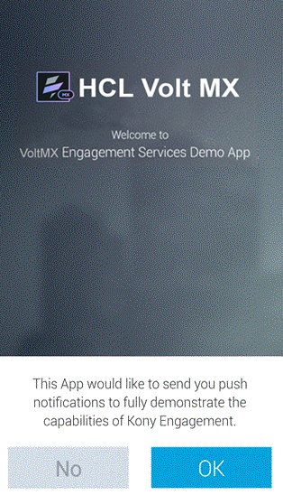
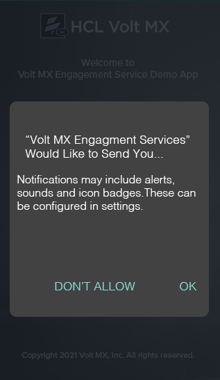
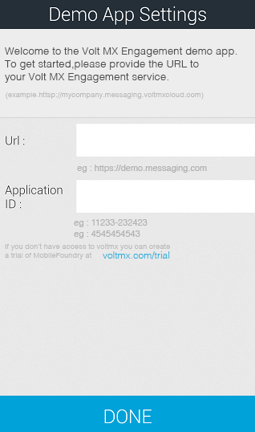
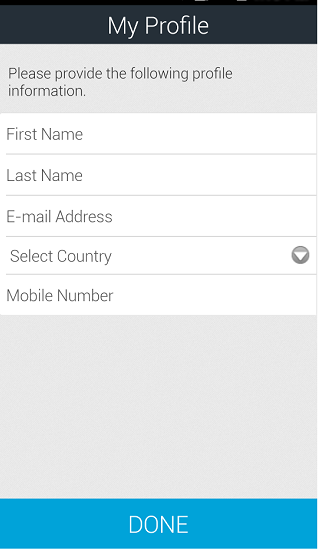
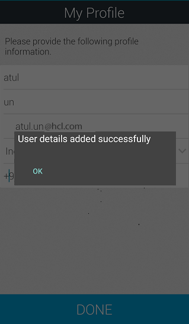
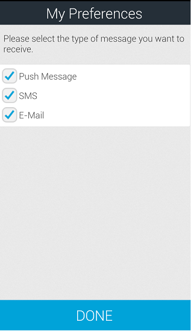

                           

Demo App QuickStart Guide (Building a Sample App – iOS): Subscribing to Ad hoc Notifications using Engagement Services Demo Application

Subscribing to Ad hoc Notifications using Engagement Services Demo Application
==============================================================================

The section explains how to subscribe for the ad hoc push, email and SMS notifications using the application installed on an iOS device.

To subscribe for the ad hoc notifications follow these steps:

1.  Launch the **Engagement** demo application that was installed earlier on the iOS device.
    
    The **Welcome to Volt MX Engagement Services Demo App** screen appears. The first screen of the application prompts the user to accept push notifications.
    
2.  Tap **Ok** to receive the push notifications.
    
    
    
    The **VoltMX Engagement Services Would Like to Send You**... alert message appears.
    
3.  Tap **Do not Allow**, if you do not want to receive the push notifications.
4.  Tap **Ok** to receive the push notifications.
    
      
    The **Demo App Settings** screen appears.  
    
5.  **Demo App Settings** screen: Enter the following details:
    *   **URI**: Enter the **Engagement** server cloud URI the user is registered.
    *   **Application ID**: Enter the **Engagement Demo App ID**.
6.  Tap **Done** to continue.
    
    
    
    The **My Profile** screen appears.  
    
7.  **My Profile**: Enter the following details for your profile:  
    
    *   **First Name**: Enter your first name.
    *   **Last Name**: Enter your last name.
    *   **E-mail Address**: Enter your personal email address.
    *   **Select Country**: Select the country from the drop-down list.
    *   **Select State**: Select the state if the county chosen in US.
    *   **Mobile Number**: Enter your personal mobile number.
    
    
    
8.  Tap **Done** to continue.
    
    The system displays the confirmation message that details added successfully.
    
    
    
9.  Tap **Ok** to continue.
    
    The **My Preferences** screen appears. The **My Preferences** screen allows you to subscribe for push, email and SMS notifications.
    
10. Select the type of notifications.
    
    
    
11. Tap **Done** to create a subscription on the **Engagement** server for all the selected types of notifications.
    
    The system displays the confirmation message that details added successfully. The information is used to create a user and user's subscription in **Engagement** server.
    
    
    
12. Tap **OK** to continue.
    
    The **VoltMX Engagement Service Demo** app is installed on your mobile device. The app displays the home screen with **My Profile** icon, **My Preference** icon and the **Trigger Event** icon.
    
    
