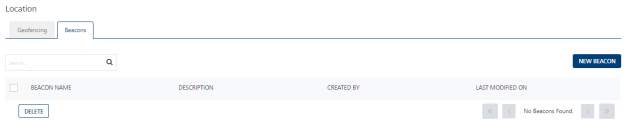
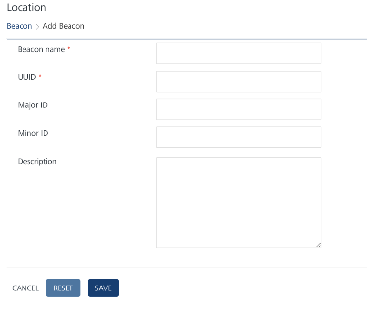

                           

Quick Start Guide – Campaign Management: [Creating Geofences and Beacons to use with Segments](Ge_Adding.md) > Adding a Beacon

Adding a Beacon
---------------

To add a Beacon, follow these steps:

1.  On the **Locations** page, click the **Beacons** tab.
    
    The **Beacons** home page appears.
    
    
    
2.  Click the **New Beacon** button on the **Beacon** screen.
    
    The **Add Beacon** screen appears.
    
    
    
    > **_Important:_** The **UUID**, **Major ID**, and **Minor ID** parameters are your Beacon's identifier and make up the key component of the advertising packets that are continually transmitted .
    
3.  Enter details for the following fields:
    *   **Beacon name**: Enter a name for the beacon.
    *   **UUID**: Enter the **universally unique identifier** (UUID) assigned to the beacon. The identifier **(UUID)** contains 32 hexadecimal digits, is split into 5 groups, and separated by dashes. For example, `f7826da6-4fa2-4e98-8024-bc5b71e0893e`.
    *   **Major ID**: Enter the major ID assigned to the beacon. The **Major ID** is a major identifier of a Bluetooth beacon.
    *   **Minor ID**: Enter the **Minor ID** assigned to the beacon. The **Minor ID** is a minor identifier of a Bluetooth beacon.
        
        > **_Note:_** The Major ID and the Minor ID fields accept inputs in number format only. If you enter an invalid input, the system displays a warning message to enter a valid number.
        
    *   **Description**: Enter an appropriate description for the beacon.
4.  Click **Cancel** if you do not want to save the entered details. The **Beacon** screen appears.
5.  Click **Reset** to clear all the entry fields.
6.  Click **Save**.
    
    The newly created beacon appears in the **Beacons** list view.
