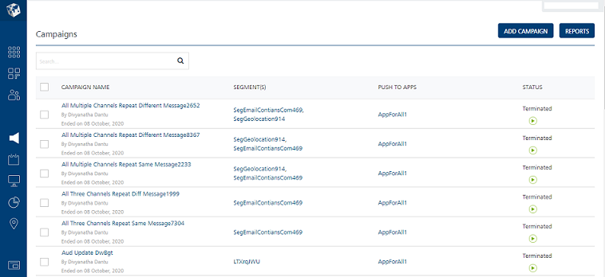
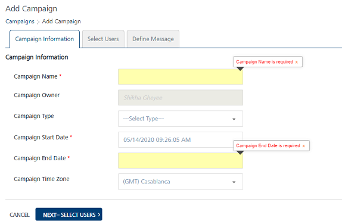
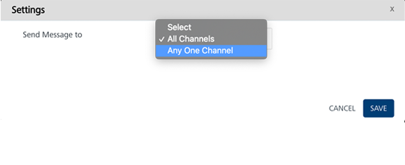
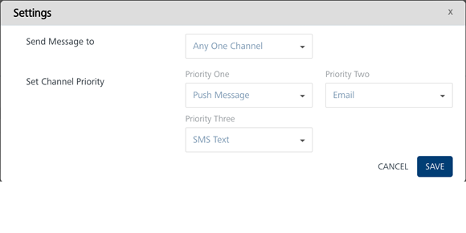
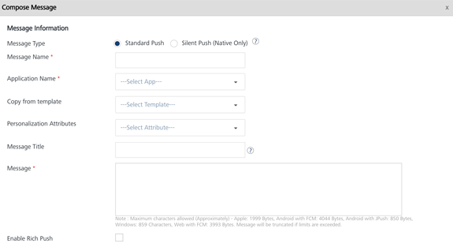
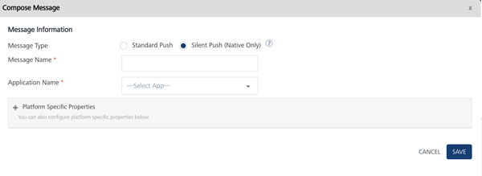
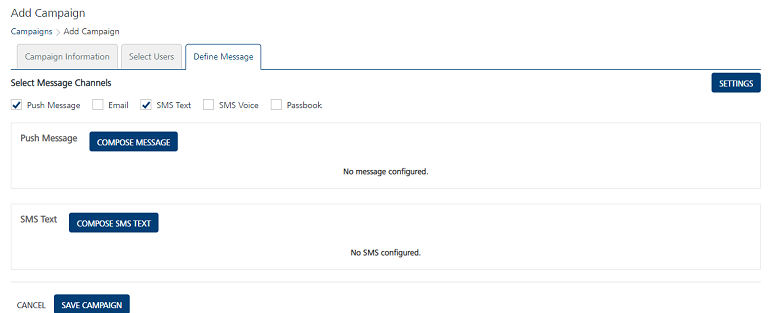
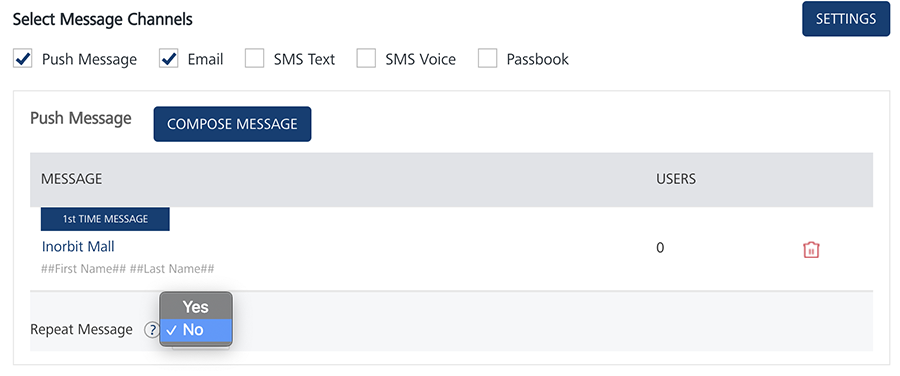
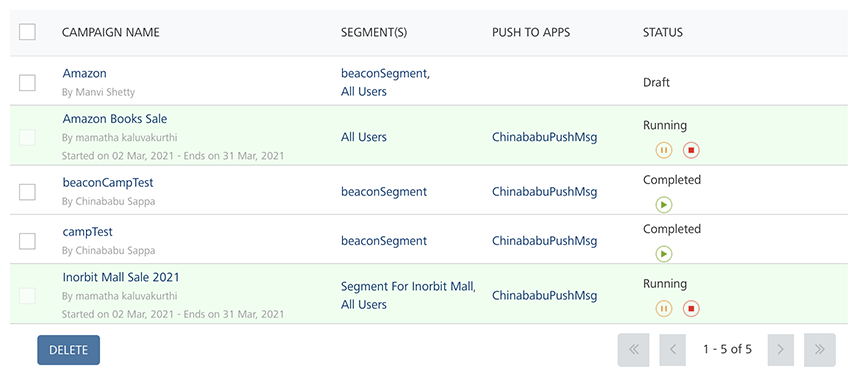

                          

Quick Start Guide – Campaign Management: Configuring and Executing a Campaign

Configuring and Executing a Campaign
====================================

The following steps explain how to configure and execute a test campaign using the segment you created earlier.

1.  Log in to **Engagement Services** console.
2.  Click **Campaigns** under the **Engagement** section to view the **Campaigns** home page.
    
    The **Campaigns** home page appears.
    
    
    
3.  On the **Campaigns** page, click the **Add Campaign** button.
    
    The **Add Campaign** page appears. The **Add Campaign** page includes the following tabs:
    
    *   [Campaign Information](#campaign-information)
    *   [Select Users](#select-users)
    *   [Define Message](#define-message)
    
    Campaign Information
    --------------------
    
    By default, the **Campaign Information** tab is set to active.
    
4.  Enter the following details in the **Campaign Information** section:
    
    *   **Campaign Name**: Enter a campaign name of no more than 255 characters.
    *   **Campaign Owner**: The field displays the name of the person who creates the campaign. You cannot change the owner details.
    *   **Campaign Type**: Select the appropriate campaign type from the drop-down list.
    *   **Campaign Start Date**: The system populates the calendar menu with the current date and time when you create a campaign. Based on when the campaign execution starts, you can change the start date of the campaign.
    *   **Campaign End Date**: To select the campaign end date, click in the text field.
        
        The system displays the standard calendar.
        
        Select the date on which you want to end the campaign and click **Done**. The system inserts the date in the **Campaign End Date** field.
        
    *   **Campaign Time Zone**: Select the required time zone to start the campaign from the drop-down list.
    
    
    
5.  Click **Cancel** if you do not want to add a campaign.
6.  Click **Next - Select Users** to navigate to the **Select Users** screen.
    
    Select Users
    ------------
    
    The **Select Users** page displays the **Select Users** list view with two columns:  
    **Segments(s)** and **Segment Users** with default number of segment users.  
    The list view includes the delete option to delete segments from the list view. There is a drop-down list below the **Segment(s)** column to select an already created segment or create a new segment.
    
    
    
7.  Select the following details on the **Select Users** screen:
    *   **Select a Segment**: Define the segment definition that suits your campaigns. You can add a new segment or select a published segment from the drop-down list. The Engagement Services does not allow you to publish a campaign without a segment.
        
        The selected segment appears in the **SEGMENT(S)** list view with the total number of associated users.
        
8.  Click **Next – Define Message** to create a message to associate with the campaigns.
    
    Define Message
    --------------
    
    You can create a multi-channel campaign to send users. When you chose at least two notification channels, Engagement Services gives you the option to define notification channel priority. The system displays the **Settings** window to set the channel priority.  
    Based on the selected channel priority, the Engagement server attempts to deliver the campaign messages.
    
9.  **Settings** window: Choose **AnyOne Channel** from the **Send Message to** drop-down list.
    
    
    
10. Choose **Push Message** for **Priority One** and **Email** for **Priority Two**.
    
    This ensures that the **Engagement** server attempts the push channel first and if the attempt is unsuccessful, use the email channel to deliver the notification. For more information about Email Channel, refer to [Adding an Email Message](../../../Foundry/vms_console_user_guide/Content/Campaigns/Defining_Notification_Types_for_a_Campaign_-_Email.md)
    
11. Click **Save** to save the settings.
    
    
    
    ### Push Message
    
12. **Push Message**: Click the **Compose Message** button in the **Push Message** grid to compose the push notification message.
    
    The **Compose Message** window appears. The **Compose Message** window includes **Message Information** section to add a new push message. The **Message Type** field includes two options to add a new push message:
    
    *   [Standard Push](#standard-push)
    *   [Silent Push](#silent-push)
    
    #### Standard Push
    
    By default, the message type option is set to **Standard Push**.
    
    To compose a standard push message, follow these steps:
    
    *   **Message Name**: Enter an appropriate name for the push message.
    *   **Application Name**: Select the required application from the drop-down list.
    *   **Personalization Attributes**: Select the attributes from the drop-down list to customize your campaign message.
        
        Based on your requirement, place the cursor in the message box to insert personalization attributes and push message. You can click X icon next to each attribute to remove the attribute from the message box.
        
    *   **Message Title**: Enter an appropriate title to the push message.
    *   **Enable Rich Push**: Select the check box if you want to associate the rich push. To customize your text, you can use the **Rich Text Editor** tool available at the top of the**Rich Content** box.
        
    
        
    
    You can also use the push message template to compose a push message.
    
    #### Silent Push
    
13. **Silent Push**: Select the option if you wish to enable the silent push.
    
    When you check the **Silent Push** option, the system displays platform-specific properties fields only. This is because the **Message Title** and the **Message Text** fields are not applicable for the silent push.
    
    
    
14. To configure a repeat message, choose the **Repeat Message** option as Yes in the **Push Message** section. The system sends repeat push messages to the same user of the campaign.
    
    
    
15. In the **Duration**field, select **Hours** and enter the value as 1.  Select **Yes** for the repeat message. This will cause a repeat push message to be sent to the subscriber every one hour. Click Save Campaign to save the campaign.
    
    
    

If the campaign is created to run in future, the Campaign home page displays the status as pending in the list view. As an example, the following images displays the Inorbit Mall campaign in running state. Once the campaign duration completes, the status of the campaign changes to completed.

