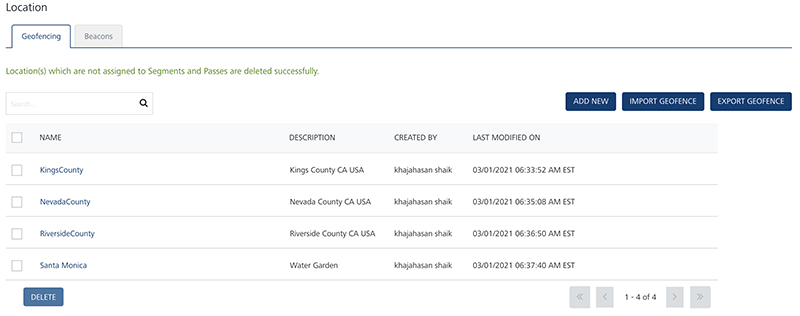
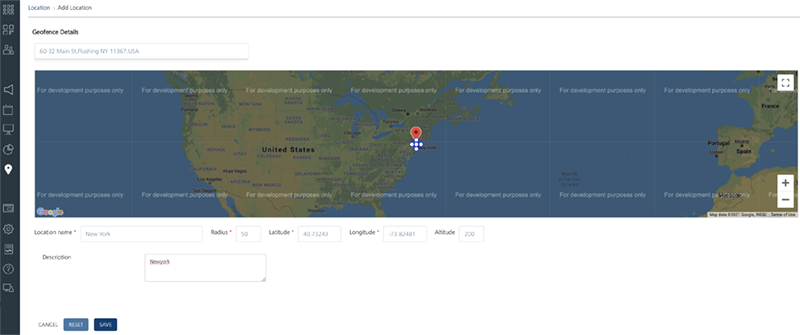
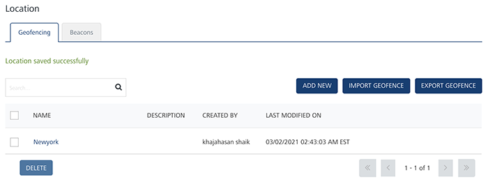
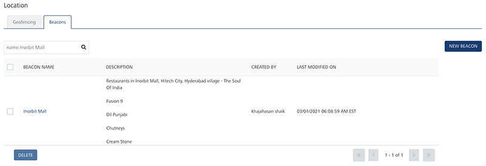
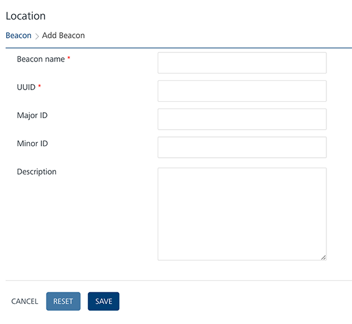
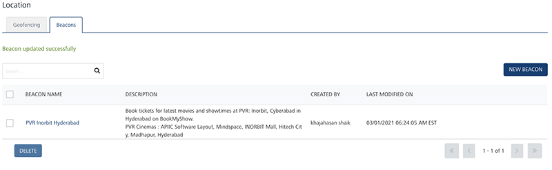

                          

Creating Geofences and Beacons to Use with Segments
===================================================

A Geofence is a virtual boundary. Geofence allows an administrator to set up triggers so when a device enters or exits the boundaries defined by the administrator, a push notification is sent to the device. An iBeacon is a precise indoor GPS mechanism that transmits signals, which can be received by other devices using Bluetooth LE (low energy) technology. iBeacons can be found in the form of hardware, or smart phones equipped with Bluetooth LE. iBeacons send signals that can be read within a range of 150 feet. Anyone with a Bluetooth LE enabled device can receive signals in the form of messages or push notifications once they are within range. An advantage of iBeacon is that it can be placed anywhere and does not need to remain. In a real scenario, when a customer enters your store, a personalized welcome message or information on the latest offers can be delivered to their device.

Geo Fences and beacons can be used in creating segments which in turn can be used with campaigns that target audiences based on geographic locations. Examples for this include sending coupons to customers who are present in a certain zip code or near a particular address.

Below are the steps to create a Geo Fence or a beacon that can be used to create a segment.

1.  After logging in to the Foundry Engagement Services console, click **Location** under the **Engagement** section on the left. Click **New Geofence** to add a new geo fence.
    
    
    
2.  Enter the address of the geofence in the **Location Name** text box on the right side. The address will be pinpointed in the map. Enter the fence name and the radius value that the notification need to be sent. The Latitude and the Longitude values will be pre-populated based on the address you entered. Enter the description as needed. Click Save to save the geo Fence.
    
    
    
3.  A screen displays that shows that the geofence is added successfully.
    
    
    
4.  To add a new beacon, click the **Beacons** tab.
    
    
    
5.  Click **New Beacon** to continue to add the beacon.  
    
6.  In the screen below, enter the beacon name and the UUID. The UUID is the unique 16-bit identifier that is assigned to a beacon. Major ID and Minor IDs help to identify a particular beacon with in a group (the Major ID and Minor ID are optional). Click **Save** after all the information is entered, to save the beacon.
    
    
    
7.  A screen displays that shows that the beacon was added successfully.
    
    
