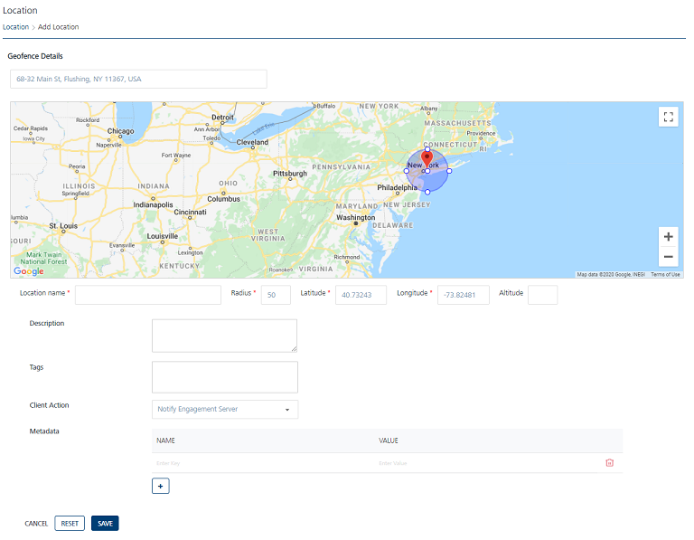
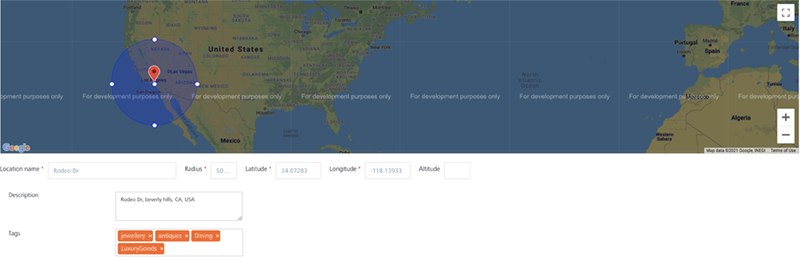

                           

Quick Start Guide – Campaign Management: Adding a Geolocation

Creating Geofences and Beacons to use with Segments
===================================================

A **Geofence** is a virtual boundary. A **Geofence** allows an administrator to set up triggers, so when a device enters or exits the boundaries defined by the administrator, a message is sent to the device.

An **iBeacon** is a precise indoor GPS mechanism that transmits signals, which can be received by other devices using **Bluetooth LE** (low energy) technology. Anyone with a **Bluetooth LE** -enabled device can receive signals in the form of messages or push notifications once they are within range. In a real-world scenario, when a customer enters your store, a personalized welcome message or information on the latest offers can be delivered to their device.

**Geofencing** and beacons can be used to create segments, which in turn can be used with campaigns that target users based on geographic locations. For example, you can send coupons to customers who are present in a certain zip code or near a particular address.

Adding a Geofence
-----------------

To add a Geofence, follow these steps:

1.  On the **Location** page, click **New Geofence**.
    
    The **Add Location** screen appears.
    
    
    
2.  Enter details for the following fields:
    
    *   **Location Name**: Enter the location name in the **Location Name** field. You can enter alphanumeric characters only.
    *   **Radius**: Enter the radius details.
    *   **Latitude**: Enter the latitude details.
    *   **Longitude**: Enter the longitude details.
        
        > **_Note:_** The **Location Name**,**Radius**,**Latitude**, and **Longitude** are the mandatory fields. If you do not enter details for these fields, the system displays an error message that the information is required.
        
    *   **Altitude**: Enter the altitude details.
        
        > **_Note:_** The altitude option is used only with a pass.
        
    *   **Description**: Enter a description for the geofence.
        
        The geofence appears in the google map. You can also use the search option to locate the geofence.
        
    *   **Tags**: Enter a tag value for a geofence. You can enter multiple tags for a geofence. The data is optional. A user can query a list of geofences based on the tags list.  
        For example, you want to visit **Rodeo Drive** to buy luxury items. You can add required tags such as, luxury goods, antiques, and jewellery.
        
        
        
    *   **Client Action**: The client action is a drop-down list with three options:
        
        
        
        *   **Notify Engagement Server**: By default, the drop-down list is set to the **Notify Engagement Server** option. Let us understand how the client action works:
            1.  Initially, the app launched on your device communicates the geographic co-ordinates of a geofence to the **Engagement** server.
            2.  The **Engagement** server maintains a list of all the geographic co-ordinates for the registered geofences. The **Engagement** server returns a set of configured geofences to the app.
            3.  The app communicates with **Iris** about the list of received geofences.
            4.  The **Iris** framework then regularly monitors the geofences and notifies the app when the device enters the particular geofence.
            5.  The app, in turn communicates with the **Engagement** server to check if there are any notifications pending for that geofence.
                
            6.  The **Engagement** server pushes any notifications associated with the geofence. If no notification is received, the communication from the app is ignored.
                
        *   **Local Client Notification**: Select the option as **Local Client Notification**. The system displays the text message box to enter the notification message.
            
            Enter a text notification message. The message is displayed when the device enters the specific geofence for which the notification is configured. For example, when you reach **Rodeo Drive Street**, the app displays the local notification message: **Welcome to Rodeo Drive**…
            
            
            
        *   **Custom Business Logic**: Select the option as **Custom Business Logic**. The system displays the JavaScript editor to enter the JavaScript code. For example, you can add the Java script code to return the geolocation of a user's position.
            
            
            
    *   **Metadata**: Enter the metadata in the form of name-value pairs. Metadata provides basic information that helps to find data related with a geofence. For example, you wish to visit **Rodeo Drive** to buy clothes and dine. The pertinent metadata tags are:
        
        *   sea-food – monkfish
        *   clothes – stefano RICC
        
        
        
    *   **Search field**: Enter the location name in the **Search** field, such as **440 N Rodeo Dr, Beverly Hills, CA 90210, USA**. The Google search displays the location in a drop-down list. Select the location.
    
    The Google map displays the location with a red icon.
    
3.  Click **Cancel** to close the window.
4.  Click **Reset** to reset the entry fields.
5.  Click **Save**.
    
    The newly added geofence appears in the **Geofencing** list view. A confirmation message appears stating that the location is saved successfully.
