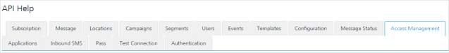

                           

Access Management
=================

From the **Admin Access** section, under **Settings**, you can add users and groups and configure them. Similarly, you can use REST APIs to add users and groups and configure them.

From the **Settings** section, click **API Help** from the left panel. The API Access page appears with sixteen tabs: **Subscription**,**Message**, **Locations**, **Campaigns**,**Segments**, **Users**, **Events**, **Templates**, **Configuration**, **Message Status**, **Access Management**, **Applications**, **Inbound SMS**, **Pass**, **Test Connection** and **Authentication**. By default, the **Subscription** tab is set to active.

To view **Access Management** details, click the **Access Management** tab in the **API Help** screen. The **Access Management** tab displays following sections:

*   [Get All Users](#get-all-users)
*   [Get User by ID](#get-user-by-id)
*   [Create User](#create-user)
*   [Modify User](#modify-user)
*   [Delete User by ID](#delete-user-by-id)
*   [Get All Groups](#get-all-groups)
*   [Get Group by ID](#get-group-by-id)
    
*   [Create Group](#create-group)
*   [Modify Group](#modify-group)
*   [Delete Group by ID](#delete-group-by-id)

For more details, see [Access Management](../../../../Foundry/engagement_api_guide/Content/Access_Management_-_General/Get_All_Permissions.md)

For more details, see [Access Management - User](../../../../Foundry/engagement_api_guide/Content/REST_API_User/Access_Management1.md)

For more details, see [Access Management - Group](../../../../Foundry/engagement_api_guide/Content/REST_API_Group/Access_Management_-_Group.md)

Get All Users
-------------

*   **URL**: Displays the sample HTTP URL to get all user details.
*   **Http Method**: Displays the http method as GET.
*   **Response Payload**: Displays the sample payload.

Get User by ID
--------------

*   **URL**: Displays the sample HTTP URL to get a user details by specific user ID.
*   **Http Method**: Displays the http method as GET.
*   **Response Payload**: Displays the sample payload.

Create User
-----------

*   **URL**: Displays the sample HTTP URL to create a user.
*   **Http Method**: Displays the http method as POST.
*   **Content Type**: Displays the content type as application/json.
*   **Response Payload**: Displays the sample payload.

Modify User
-----------

*   **URL**: Displays the sample HTTP URL to modify a user.
*   **Http Method**: Displays the http method as POST.
*   **Content Type**: Displays the content type as application/json.
*   **Response Payload**: Displays the sample payload.

Delete User by ID
-----------------

*   **URL**: Displays the sample HTTP URL to delete a user.
*   **Http Method**: Displays the http method as POST.
*   **Content Type**: Displays the content type as application/json.
*   **Response Payload**: Displays the sample payload.

Get All Groups
--------------

*   **URL**: Displays the sample HTTP URL to get all the groups details.
*   **Http Method**: Displays the http method as GET.
*   **Response Payload**: Displays the sample payload.

Get Group by ID
---------------

*   **URL**: Displays the sample HTTP URL to get a group's details by group ID.
*   **Http Method**: Displays the http method as GET.
*   **Response Payload**: Displays the sample payload.

Create Group
------------

*   **URL**: Displays the sample HTTP URL to create a group.
*   **Http Method**: Displays the http method as POST.
*   **Content Type**: Displays the content type as application/json.
*   **Response Payload**: Displays the sample payload.

Modify Group
------------

*   **URL**: Displays the sample HTTP URL to modify a group.
*   **Http Method**: Displays the http method as POST.
*   **Content Type**: Displays the content type as application/json.
*   **Response Payload**: Displays the sample payload.

Delete Group by ID
------------------

*   **URL**: Displays the sample HTTP URL to delete a group by specific group ID.
*   **Http Method**: Displays the http method as POST.
*   **Response Payload**: Displays the sample payload.
