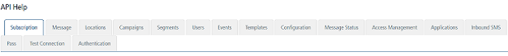

                           

Applications
============

From the **Apps** section, under **Overview**, you can add applications and configure them. Similarly, you can use REST APIs to add applications and configure them.

From the **Settings** section, click **API Help** from the left panel. The API Access page appears with sixteen tabs: **Subscription**,**Message**, **Locations**, **Campaigns**,**Segments**, **Users**, **Events**, **Templates**, **Configuration**, **Message Status**, **Access Management**, **Applications**, **Inbound SMS**, **Pass**, **Test Connection** and **Authentication**. By default, the **Subscription** tab is set to active.

To view **Applications** details, click the **Applications** tab in the **API Help** screen. The **Applications** tab displays the following sections:

*   [Get All Applications](#get-all-applications)
*   [Get Application by ID](#get-application-by-id)
*   [Create Application](#create-application)
    
*   [Modify Application](#modify-application)
    
*   [Add Apple Platform](#add-apple-platform)
    
*   [Add/Modify Android Platform](#add-modify-android-platform)
    
*   [Add/Modify Windows Platform](#add-modify-windows-platform)
    
*   [Add/Modify MPNS Platform](#add-modify-mpns-platform)
    
*   [Delete Application by ID](#delete-application-by-id)
    
*   [Publish Application](#publish-application)
    
*   [Unpublish Application](#unpublish-application)
    

For more details, see [Applications](../../../../Foundry/vms_messaging_apis/Content/REST_API_Application/Applications_API.md)

Get All Applications
--------------------

*   **URL** : Displays the sample HTTP URL to get all the application details.
*   **Http Method**: Displays the http method as GET.
*   **Response Payload**:Displays the sample payload. for the GET method.

Get Application by ID
---------------------

*   **URL** : Displays the sample HTTP URL to get an application details by specific application ID.
*   **Http Method**: Displays the http method as GET.
*   **Response Payload**:Displays the sample payload. for the GET method.

Create Application
------------------

*   **URL** : Displays the sample HTTP URL to create an application.
*   **Http Method**: Displays the http method as POST.
*   **Content Type**: Displays the content type as application/json.
*   **Request/Response Payload**:Displays the sample payload. for the POST method.

Modify Application
------------------

*   **URL** : Displays the sample HTTP URL to modify an application.
*   **Http Method**: Displays the http method as PUT.
*   **Content Type**: Displays the content type as application/json.
*   **Request/Response Payload**:Displays the sample payload for the PUT method.

Add Apple Platform
------------------

*   **URL** : Displays the sample HTTP URL to add apple platform to an app.
*   **Http Method**: Displays the http method as POST.
*   **form data params**: Displays the parameters to add Apple platform.
*   **Response Payload**:Displays the sample payload for the POST method.

Add/Modify Android Platform
---------------------------

*   **URL** : Displays the sample HTTP URL to add or modify Android platform details.
*   **Http Method**: Displays the http method as PUT.
*   **Content Type**: Displays the content type as application/json.
*   **Request/Response Payload**:Displays the sample payload for the PUT method.

Add/Modify Windows Platform
---------------------------

*   **URL**: Displays the sample HTTP URL to add or modify Android Windows platform details.
*   **Http Method**: Displays the http method as PUT.
*   **Content Type**: Displays the content type as application/json.
*   **Request/Response Payload**:Displays the sample payload for the PUT method.

Add/Modify MPNS Platform
------------------------

*   **URL** : Displays the sample HTTP URL to add or modify MPNS platform details.
*   **form data params**: Displays the required parameters to add or modify MPNS platform.
*   **Response Payload**:Displays the sample payload.

Delete Application by ID
------------------------

*   **URL**: Displays the sample HTTP URL to delete an application by specific app ID.
*   **Http Method**: Displays the http method as POST.
*   **Response Payload**:Displays the sample payload for the POSTmethod.

Publish Application
-------------------

*   **URL**: Displays the sample HTTP URL to publish an application.
*   **Http Method**: Displays the http method as POST.
*   **Response Payload**:Displays the sample payload for the POST method.

Unpublish Application
---------------------

*   **URL**: Displays the sample HTTP URL to unpublish an application.
*   **Http Method**: Displays the http method as POST.
*   **Response Payload**:Displays the sample payload for the POST method.
