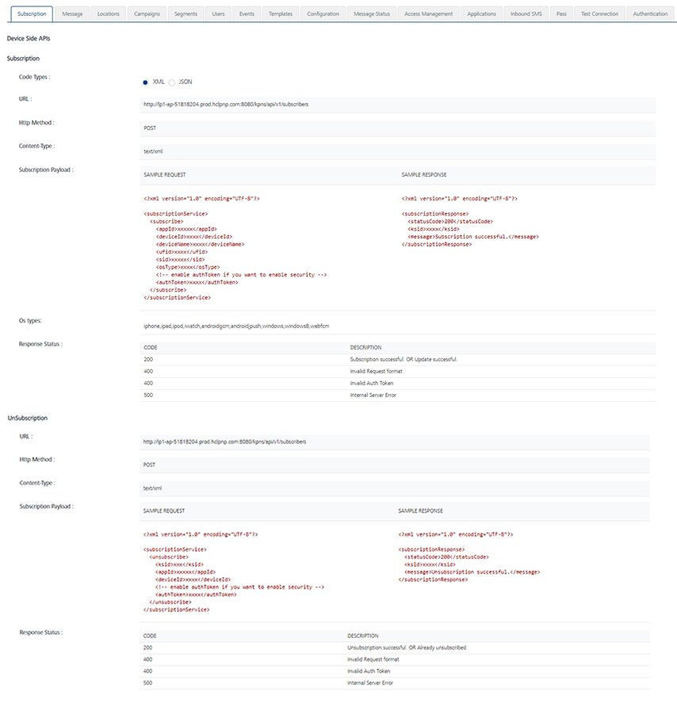

                           

Subscription
============

From **Subscribers** screen, you can view a comprehensive list of **Devices** and **Users**. For each functionality available under Subscriber module restful services are provided.

From the **Settings** section, click **API Help** from the left panel. The API Access page appears with sixteen tabs: **Subscription**,**Message**, **Locations**, **Campaigns**,**Segments**, **Users**, **Events**, **Templates**, **Configuration**, **Message Status**, **Access Management**, **Applications**, **Inbound SMS**, **Pass**, **Test Connection** and **Authentication**. By default, the **Subscription** tab is set to active.

The **Subscription** section displays following fields:

*   **Code Types**: Displays that sample request and response payload is in XML or JSON format.
*   **URL**: Displays the sample HTTP URL to post input parameters for subscription related services.
*   **Http Method**: Displays the http method as Post.
*   **Content-Type**: Displays sample payload's request header content types.
*   **Subscription Payload**: Displays the sample payload.
    
*   **Os Type**: Displays the operating systems.
*   **Response Status**: Displays the various responses status codes and their description.
    
    
    

For more details, refer [Subscriber](../../../../Foundry/vms_messaging_apis/Content/REST_API_Subscribers/Subscription.md)s
