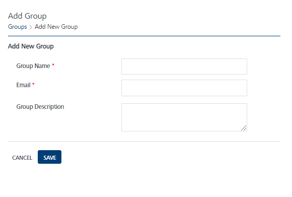

                             

Adding a Group
==============

Based on requirements, you can add new groups to Volt MX Foundry Engagement Services.

To add a new group, follow these steps:

1.  On the **Groups** page, click the **Add New Group** button.
    
    The **Add New Group** page appears.
    
    
2.  Enter details for the following fields:
    1.  **Group Name**: Enter the group name to appear on the page. It can be alphanumeric. You cannot create user names with special characters such as / \\ \[ \] : ; | = , + \* ? < > @ "
    2.  **Email**: Enter the email address of the group.
    3.  **Group Description**: Enter a logical description for the group that conveys its purpose.
        
        > **_Note:_** The fields marked with a red asterisk are mandatory fields.
        
3.  Click the **Cancel** button to exit from the window without saving any information.
4.  Click the **Save** button.  
    The group appears in the **Groups** list view on **Groups** home page. The system displays a confirmation message that the group saved successfully.
