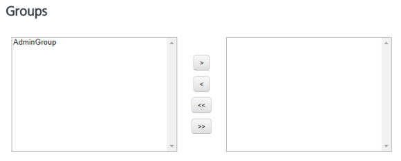

                             

Assigning or Unassigning Groups to a Member
===========================================

Based on requirement, you can assign or unassign groups to a user.

To assign or unassign groups to a user, follow these steps:

1.  Click the required user name under the **Name** column in the list view.
    
    The **Member Details** page appears.
    
2.  Navigate to the **Groups** section.
    
    
    
3.  Select a group from the left pane, and click the **right arrow** to assign the selected group. You can click the **double-right arrow** to assign all the groups from the left pane to the member.
4.  Select a group from the right pane, and click the **left arrow** to unassign the selected group. You can click the **double-right arrow** to unassign all the groups from the member.
5.  Click the **Cancel** button if you do not want to assign or unassign groups to a member.
6.  Click the **Save** button to save the updates.
    
    The system displays the updated member in the list view with a confirmation message that the user updated successfully.
