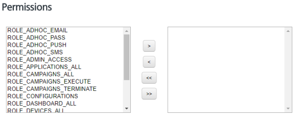

                             

Assigning or Unassigning Permissions to a Group
===============================================

Based on your role you can assign or unassign permissions to groups.

To assign or unassign permissions to group, follow these steps:

1.  On the **Groups** screen, under the **Group Name** column, click the required group name.
    
    The **Groups Details** page appears.
    
    
    
2.  To assign or unassign permissions to a group, do the following:
    1.  Navigate to the **Permissions** section.
    2.  Select a permission from the list in the left pane, and click the **right arrow** to assign the selected permission. You can click the **double-right arrow** to assign all the permissions from the left pane to the group.
    3.  Select a permission from the list in the right pane, and click the **left arrow** to unassign the selected permission. You can click the **double-right arrow** to unassign all the permissions to the group.
3.  Click **Cancel** if you do not want to assign or unassign any permission to the group. The system displays the **Groups** page without saving any information.
4.  Click the **Save** button.  
    The updated group appears in the groups list view with a confirmation message that the user updated successfully.
