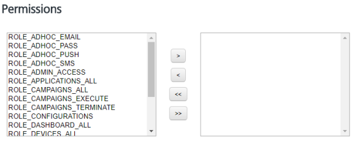
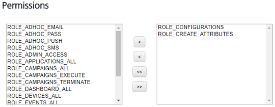

                             

Assigning or Unassigning Permissions to a Member
================================================

Based on requirements, you can assign or unassign access permissions to a member.

To assign or unassign permissions to a member, follow these steps:

1.  Click the required member name under the **Name** column in the list view.
    
    The **Member Details** screen appears.
    
2.  Navigate to the **Permissions** section.
    
    
    
3.  Select a permission from the left pane, and click the **right arrow** to assign the selected permission. You can click the **double-right arrow** to assign all the permissions from the left pane to the member.
4.  Select a permission from the right pane, and click the **left arrow** to unassign the selected permission. You can click the **double-right arrow** to unassign all the permissions from a member.
5.  Click **Cancel** if you do not want to assign or unassign any permission to the member.
6.  Click the **Save** button to save the updates.
    
    The system displays the updated member in the list view with the confirmation message that the user updated successfully.
    
    Assigning Custom Attribute Creation Permissions
    -----------------------------------------------
    
    You can add custom user attributes such as zip code, phone number, or birth date as required. For example, you want to send a promotional campaign to users living in a specific zip code area. To add custom attribute creation permissions, follow these steps:
    
    1.  Select the permission `ROLE_CONFIGURATIONS` from the left pane, and click the right arrow to assign the selected permission.
    2.  Next, select the permission `ROLE_CREATE_ATTRIBUTES` from the left pane, and click the right arrow to assign the selected permission.
        
        
        
    3.  Click **Cancel** if you do not want to assign or unassign the permission to the member.
    4.  Click the **Save** button to save the updates.
    
    The system displays the updated member in the list view with the confirmation message that the user updated successfully.
