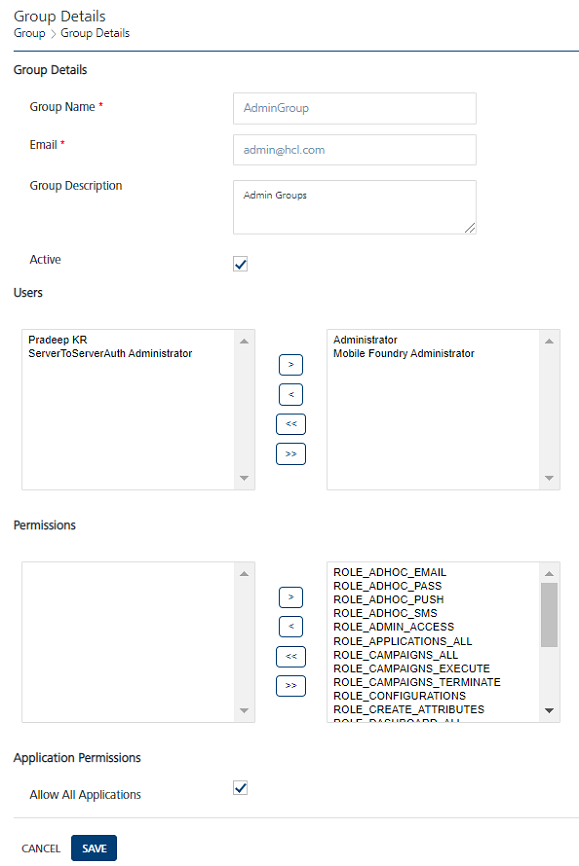

                              

Modifying a Group
=================

To view or modify a group, follow these steps:

1.  On the **Groups** page, under the **Group Name** column, click the required group.
    
    The **Group Details** page appears.
    
    
2.  You can update details for the following fields:
    
    | Group Element | Description | Modification Allowed |
    | --- | --- | --- |
    | Group Name | The displayed name of a group. | Yes |
    | Email | The email ID of a group. | Yes |
    | Group Description | The information of a group. | Yes |
    | Active | The current status of a group as active or inactive. | Yes |
    | Users | The assigned users to a group. | Yes |
    | Permissions | The assigned permissions to a group. | Yes |
    
3.  If you do not want to update the group details, click the **Cancel** button. The system displays the **Groups** page without saving any information.
4.  Click the **Save** button.  
    The updated group appears in the list view with a confirmation message that the group updated successfully.
