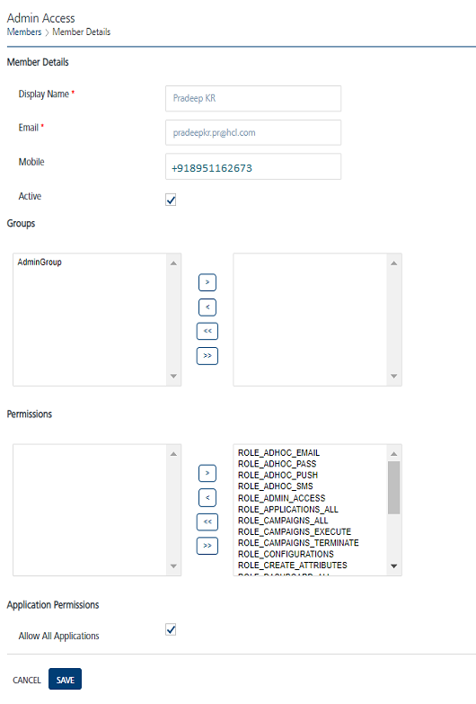

                              

Modifying a Member
==================

To view or modify a member, follow these steps:

1.  Click the required member name under the **Name** column in the list view.
    
    The **Members Details** screen appears.
    
    
    
2.  You can update the details for the following fields:
    
    | Member Element | Description | Modification Allowed |
    | --- | --- | --- |
    | Display Name | The displayed name of a member. | Yes |
    | Email | The email ID of a member. | Yes |
    | Mobile | The mobile number of a member. | Yes |
    | Active | By default the member status is set to active. You can deselect the checkbox to make the member status as inactive. | Yes |
    | Group | The group to which the member belongs. Based on requirement you can assign or unassaign a member to a group. | Yes |
    | Permissions | The assigned permissions to perform tasks. Based on requirement you can assign or unassaign permissions to a member. | Yes |
    
3.  Click the **Reset Password** button to reset the password. The system displays the **Reset Password** window. For more information about how to reset a password, see [Resetting Member Password.](Resetting_User_Password.md)
4.  Click the **Cancel** button to exit without saving any information.The system displays the **Members** page.
5.  Click **Save**.
    
    The system updates the member in the list view and displays the **Members** screen.
