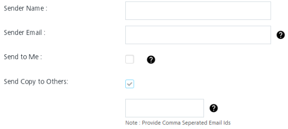

                             

Email Message
=============

Email messages is one of the most important features of Volt MX Foundry Engagement Services. You can send an email message through users or segments. The primary purpose of this feature is to allow registered users to set an email message based on own preferences. A registered user can use an email message template, set new attributes, add recipients to receive email messages, and set time for email messages to be sent.

To add an email message, follow these steps:

1.  From the **Engagement** section, click **Adhoc** from the left panel. The Adhoc screen appears with three tabs including:
    
    *   [Adhoc Information](#adhoc-information)
    *   [Select Users](#select-users)
    *   [Define Message](#define-email-message)
    
    Adhoc Information
    -----------------
    
    By default, the Adhoc Information tab is set to active.
    
2.  **Select Channel**: Select the Email Message channel from the drop-down list.
    
    
    
3.  **Send Message**: By default, the send message option is set to **Now**. If you want to send the email message on a specific date, then you need to choose the **Later** option. For more details [see](Set_Start_and_Expiry_Time_-_email.md)
4.  Click the **Next -Select Users** button to continue.
    
    Select Users
    ------------
    
    The **Select Users** tab becomes active.
    
5.  Based on your requirement, select the option as Users or Segment. By default, the **User Information** option button is set to **Users.** The User's list view is populated with the existing list of users.
    
    *   [Users](#users)
    *   [Segments](emailsegment/esegment.md#top)
        
    
    ### Users
    
6.  When you select the option as users, the system displays the user's list view with following details:
    
    
    
    The Users list view includes the Name, Email and Mobile columns. There is a search field to search users.
    
    *   **Search** field: Click in the search field to view available options to search for a user. You can search users based on the following search criteria:

    *   **Name**: Enter the name in the search field and click **Enter**.

            
    

            
    The users appears on the home page. To view the select users’ page, clear the search field and click Enter.

            
    

            
    *   **Email**: Enter the email ID in the search field and click **Enter**.

            
    

            
    The users appears on the home page. To view the select users’ page, clear the search field and click Enter.

            
    

            
    *   **Mobile Number**: Enter the mobile number in the search field and click **Enter**

            
    

            
    The users appears on the home page. To view the select users’ page, clear the search field and click Enter.

            
    

            
    > **_Note:_** If no user is added to the console, then user information page displays the following message: 'No user found'.
            
    The Users list view displays the following details:
            
    | Users Element | Description |
    | --- | --- |
    | Name | The name column displays names of the added users. The Name column contains a combination of the First Name and the Last Name of added users. |
    | Email | The email column displays the emails of the added users. |
    | Mobile | The mobile column displays the mobile numbers of the added users. |
    | Display controls: | By default, only 20 users are displayed in the list view. You can view more screens by navigating through the forward arrow icon. You can navigate back through the backward arrow icon. |
        
            
7.  **Addressing an Email:** When you send an email, you have three field choices: To, cc, and bcc. Here is how to use each field:
    
    *   **To**: Select the required users from the list view, the email is targeted.
        
        
        
    *   **Carbon Copy (Cc)**: Select the required users from the list view, you want to know about the email (remember that all users can see their names).
    *   **Blind Carbon Copy (Bcc)**: Select the required users from the list view, you want to know about the email but hide the list of recipients from other recipients.
8.  Click **Cancel** if you do not want to create an email message.
9.  Select the required users from the list view to send email message.
10. Click **Next -Define Message** to continue.
    
    Define Email Message
    --------------------
    
    The **Define Message** page appears.
    
11. **Sender Name** : Enter the sender's name.
12. **Sender Email**: Enter your email ID. This will be the From address in the sent mail.
    
    > **_Note:_** This name will be visible on an email as the sender name. If you do not enter the sender name, then Volt MX Foundry Engagement Services will pick up it from mail configuration, and use sender’s email id as sender name.
    
13. **Send to Me**: If you want to receive a copy of the email message, then you can select the **Send to Me** checkbox.
    
    > **_Note:_** The logged on user email will be used in cc, thus you will get a copy of all the mails sent to the user. A single mail per user is sent, so if there are 10 users, then there will be 10 separate mails for each user and you will receive 10 emails.
    
    > **_Important:_** The sent mail is marked as opened, if you open it.
    
14. **Send Copy to Others**: If you want to send the email message to other recipients users, then select the **Send Copy to Others** checkbox.
    
    The entry field appears.
    
    
    
    > **_Note:_** You get a copy of all the mails sent to the users. A single mail per user is sent. If there are 10 users, then there are 10 separate mails for each user, and you receive 10 emails.
    
15. Enter required email ids separated with commas.
    
    
    
    ### Email Message
    
    There are two options to create an email message:
    
    *   [Compose from Template](#compose-from-template)
    *   [Compose New Email](#compose-new-email)
    
    #### Compose from Template
    
16. To compose an email message from template, follow these steps:
    
    1.  **Compose from Template**: Select the required template from the drop down list.
        
        
        
        The Email Subject field and Message box area is populated with the text from the chosen template.
        
        
        
    2.  **Personalization Attributes**: Select the attributes from the Personalization Attributes drop-down list to customize the email. The Personalization Attributes lists all the system defined attributes along with the other attributes that you define in the Add Attributes.
    
    #### Compose New Email
    
17. To compose a new email message, follow these steps:
    1.  **Email Subject**: Enter an appropriate subject for the email.

    2.  **Personalization Attributes**: Select the attributes from the Personalization Attributes drop-down list to customize the email. The Personalization Attributes lists all the system defined attributes along with the other attributes that you define in the Add Attributes.
        
    
        
    The selected personalization attributes appears in the message text area.The system inserts the selected attributes at the cursor position in the compose message text area. You can insert any attribute anywhere in the text message as required for your email message.
        
     
        
    3.  **Message**: To customize your text, you can use the Rich Text Editor tool bar available at the top of Rich Content box.
        
    
        
18. Click **Send** to continue.
19. The system displays the confirmation message that message queued with a request ID for reference. You can use this request ID to view the current status of the email message under Settings > Status > Email Queue.
    
    
    
20. Click **Ok** to continue.
    
    ### API Payload
    
21. **API Payload**: Click the **View API Payload** button to get details of the API call that can be used by a third party system to send notifications.
    
    
    
    > **_Note:_** Refer the payload drop-down window details as a sample only.
