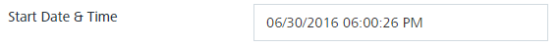

                           

Send Message
============

The Send Message option enables to send pass messages based on your choice. You can configure the start date, expiry date and time. By default, the **Now** option is selected. You can change the option to the **Later** for scheduling date and time to send pass messages. When the **Now** option is selected, the **Send** button is available to send pass messages.

1.  **Now**: Click **Send** to send the pass message. The system displays the confirmation message that the message is in a queue with the corresponding message ID for reference. When the Now option is selected, the Volt MX Foundry Engagement Services sends messages as high priority.

1.  Click the **Later** option button to schedule the date and time for pass messages to be sent. The system sends the pass message based on following configuration.
    1.  **Start Date and Time**: The system displays the current date and time. If required you can update the start date and time. To update the details, click in the text field. The Calendar menu appears.
        
        
        
    2.  Select the required date in the calendar and click **Done**. The selected date with the current time appears in the **Start Date and Time** field.
        
        
        
        > **_Important:_** You can also revert the date to current date and time by clicking the **Now** button in the calendar wizard.
        
    3.  **Expiry Date and Time**: to set the expiry date, click in the expiry date and time field. The system displays the calendar wizard to set date and time. Select the required date in the calendar and click **Done**. The selected date with the current time appears in the **Expiry Date and Time** field.
        
        
        
    4.  **Time -Zone**: Click in the **Time -Zone** field. The time-zone menu appears. Select the required time zone. The selected time zone appears in the time zone field.
        
        
        
    
    6.  Click the **Schedule Notification** button. The system displays the confirmation message that message queued with a pass message request ID for reference. Click OK to continue.  
        
        > **_Note:_** When you select the **Later** option, the **Send** button turns into the **Schedule Notification**button to send push notifications.
