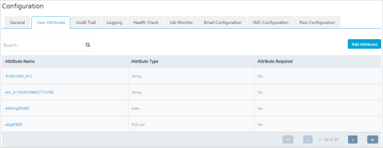
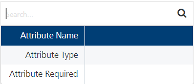
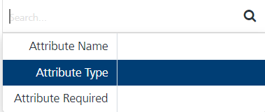
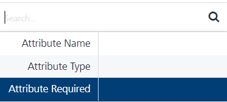

                              

User Attributes
===============

The custom user attributes, enables you to add additional required data for your record. For example, you can add age as a user attribute under the special attribute type - Number to send promotional campaigns to use more than 18 years of age. A total of 30 user attributes can be added.

In the **Configuration** home page, click the **User Attributes** tab. The **User Attributes** home page displays the list view including **Attributes Name**, **Attributes Type** and **Attributes Required** columns. There is a button to add user attributes in the top right corner of the home page and a search field to search the user attributes.

*   **Add Attributes** button: The button helps you to add new attributes to the list.
*   **Search** field: Click in the search field to view options to search user attributes. You can search user attributes based on the following criteria:
    *   **Attribute Name**: Enter the attribute name in the search field and click **Enter**.
        
        
        
        The user attribute details appears on the home page. To clear your search result, click in the search field.
        
    *   **Attribute Type**: Enter the attribute type as string in the search field and click **Enter**.
        
        
        
        The user attribute details appears on the home page. To clear your search result, click in the search field.
        
    *   **Attributes Required**: Enter in search field if the attribute is required as Yes or No.
        
        
        
        The user attribute details appears on the home page. To clear your search result, click in the search field.
        

The **User Attributes** list view contains the following details:

  
| User Attributes | Description |
| --- | --- |
| Attributes Name | The attribute name column displays the attribute names, such as First Name. |
| Attribute Type | The attribute type column displays the attribute types. |
| Attribute Required | The attribute required column displays the status of an attribute as mandatory or not required. |
| Display controls | By default, only 20 attributes are displayed on the grid. You can view more screens through the **Forward** arrow icon. You can move back through the **Backward** arrow icon. |

You can do the following tasks from the User Attribute screen:

*   [Adding User Attributes](Adding_Attributes_to_Audience.md)
*   [Modifying User Attributes](Modifying_an_Attribute.md)
