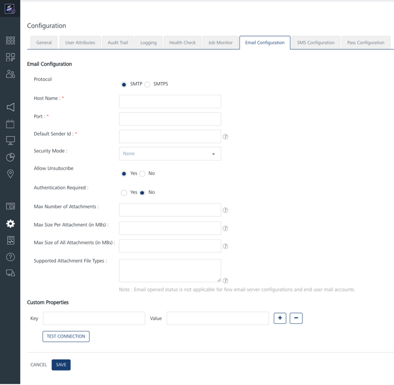
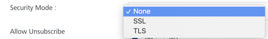
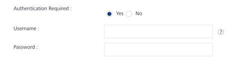
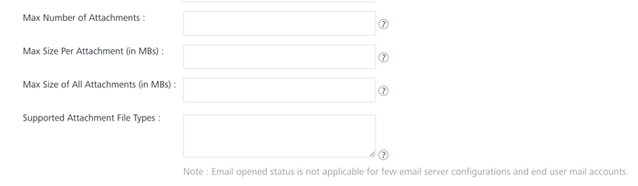
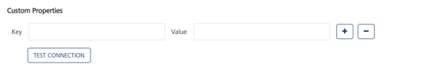

                            

Email Configuration
===================

For email configuration, you need to provide the following details:

1.  From the **Settings** section, click **Configuration** from the left panel.
    
    The **Configuration** page appears. By default, the **General** tab is set to active.
    
2.  Click the **Email Configuration** tab.
    
    The **Email Configuration** page appears.
    
    
    
    The Email Configuration page includes the two sections:
    
    *   [Email Configuration](#email-configuration)
    *   [Custom Properties](#custom-properties)

Email Configuration
-------------------

4.  For email configuration, enter details for the following fields:
    
    1.  **Protocol:** Select the protocol as SMTP (Simple Mail Transfer Protocol) or SMTPS (Simple Mail Transfer Protocol Secure). By default, the protocol is set to SMTP.
    2.  **Host Name**: Enter the host name details. The host name is used for communication on the network, for example, `xxxxx.xxxxx.net`.
    3.  **Port**: Enter the port number for the outgoing mail server.
    4.  **Default Sender Id**: Enter your email ID. The system uses the default sender email ID to send email notifications, for example, `xxxxx@xxx.com`.
    5.  **Security Mode**: Based on your requirement, select the security mode from the drop-down list as **None**, **SSL** (Secure Sockets Layer), or **TLS** (Transport Layer Security).
        
        
        
        > **_Note:_** Transport Layer Security (TLS) and Secure Sockets Layer (SSL) are the cryptographic protocols that provide communications security over a computer network.
        
    6.  **Allow Unsubscribe**: By default, the **Allow Unsubscribe** option is set to true. Based on your requirement, select the option as **Yes** or **No**.  
        If the **Allow Unsubscribe** option is set to false, the users who receive the email notifications, do not have an option to unsubscribe from emails received through Volt MX Engagement Services.
        
        
        
    7.  **Authentication Required**: By default, the option is set to **No**. Based on your requirement, select the option as **Yes** or **No**.
        *   If you select the option as Yes, the Username and the Password fields appear.
            1.   **Username**: Enter your name in the **Username** field.
            2.  **Password**: Enter the password in the **Password** field.
                
                
                
                > **_Note:_** The email opened status is not applicable for a few email server configurations and end user mail accounts.
                
    8.  **Max Number of Attachments**: This configuration restricts the max no. of attachments that can be sent in the email. By default, the maximum number of attachments that can be sent in an email is set to 4.
    9.  **Max Size Per Attachment (in MBs)**: This configuration restricts the max size of any attachment in the email. By default, the size of an attachment in the email should not exceed 10MB.
    10.  **Max Size of All Attachments (in MBs)**: This is the maximum size of the Email message including attachments and content (after base64 encoding), supported by your SMTP service provider. By default, the total size of attachments in the email should not exceed 10MB.
        
        > **_Note:_** The email content is base64 encoded and then sent to the service provider. The limit set at the service provider's end is for this base64 encoded message. Generally, base64 encoded size is 1.34 times the actual size. For example, if Amazon SES supports 10 MB email size, you must not upload an attachment larger than 7.5 MB.
        
    11.  **Supported Attachment File Types**: Enter the attachment file types supported by the SMTP service provider. The file type must be separated by a comma. For example, `pdf,doc,docx,xls,xlsx`. By default, the types of attachments allowed are: .pdf, .xls, .xlsx, .csv, .txt, .doc, .docx, .ppt, .pptx, .pps, .zip, .rar, .tar, .gzip, .log, .jpeg, .jpg, .png.
    
    
    
    Custom Properties
    -----------------
    
5.  **Custom Properties**: You can add email server specific custom properties to provide additional features. Apart from this, the custom properties can also be used to configure number of emails to be sent in one connection, for example:
    
    *   **Key** : `batchSize.sendEmail`
    *   **Value**: `integer`, defaults to 30
    
    1.  **Key**: Based on your requirement, enter the key in the **Key** field.
    2.  **Value**: Enter an appropriate value in the **Value** field.
        
        Defining the custom properties is an optional feature in Email configuration.
        
        
        
6.  Click **Test Connection**. The system establishes a connection with the SMTP server and displays the confirmation message that the SMTP server connection is successful.
7.  Click **Cancel** if you do not want to save the email configuration.
8.  Click **Save**. The system displays the confirmation message that the email configuration is saved successfully.
