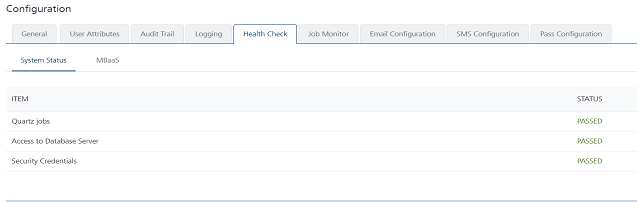

                             

Health Check
============

Health Check feature examine various layers and components such as database connectivity, socket factories, memory cache, and application server health. Health Check feature detects file corruptions, physical and logical block corruptions, undo and redo corruptions and data dictionary corruptions as well. The Health Check screen displays the status as either **Passed** or **Failed** for all findings and offer recommendations to resolve problems.

At present, system displays current session health checks in the list view for the following items only:

*   Access to Database Server
*   Admin Security Credentials
*   Quartz Jobs

> **_Note:_** The Health Check section is applicable for Volt MX Foundry Engagement Services on-premises version only.

You can view the health checks as either pre-authentication or post-authorization to Volt MX Foundry Engagement Services. The system displays health checks only related to Volt MX Foundry Engagement Services as part of pre-authorization, for example, access to database server, admin security credentials.

> **_Note:_** View more health checks once you have logged in to Volt MX multi-tenant console. These include cloud-related results such as SQS URL, Memcache (file system), and static resources.

Based on any of the health check items and status, the administrator should search respective items and rectify any issue, if required. In the **Configuration** screen, click the **Health Check** tab. The system displays the Health Check screen.

The **Health Check** list view contains the following details:

Item
----

The **Item** column lists following health check items.

*   **Access to Database Server**: The access to database server verifies whether application server is connected to the database server.
*   **Admin Security Credentials**: The admin security credentials verify whether default user “_Administrator_” is configured.
*   **Quartz Jobs**: Quartz runs a set of jobs at server side to initiate push message jobs, and also runs at every 30 seconds. You can change the value at the `monitor.schedule`  in the  `configResource.xml`
    
    > **_Important:_** When the _PUSH\_FEEDBACK\_JOB, PUSH\_MESSAGES\_JOB,_ and _REPORTS\_JOBs_ in the **Administration > Job Monitor** section are running successfully, only then will the system set the status as **PASSED** for the **Quartz jobs** item in the **Administration > Health Check** section.
    

Status
------

The Status column displays status for all health check items.

*   **PASSED**: The system shows PASSED when validation is successful.
*   **FAILED**: If validation fails, then the status is FAILED.
    
    > **_Important:_** If items in the Health Check fails , it indicates that Volt MX Foundry Engagement Services is not started properly.
