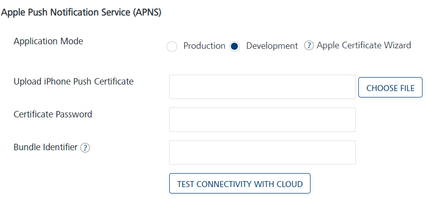
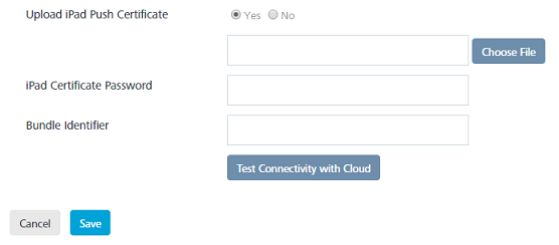

                           

Apple
=====

1.  To configure the **Apple** platform, enter details for the following fields:

*   **Application Mode**: (Production or Development): By default, the application mode is set to production. Based on your requirement, select production or development.
    
    The application mode indicates the current status of the project. Push certificates are changed depending on the choice of application mode, and each mode requires a separate certificate.
    
    1.  **Production Mode**: Use this mode if you want to run the application in production mode.
    2.  **Development Mode**: Use this mode if you want to develop or test an application.

> **_Important:_** Volt MX Foundry Engagement Server provides the following two Connection methods:

*   **Certificate-Based Connection**: For Certificate Based Connection, you must provide the Apple Push Certificate and the Certificate Password.
*   **Token-Based Connection**: For Token Based Connection, you can either provide the Bundle Identifier, or an Apple Push Certificate. If you use the certificate, the Bundle Identifier is extracted from it.. To use Token Based Connection, you must first provide the **Key Id**, **Team Id**, and **Provider Private Key** in the [Configuration page](../Administration/General_-_Settings.md#basic).  
    For more information, refer [Establishing Token -Based Connection to APNS](https://developer.apple.com/documentation/usernotifications/setting_up_a_remote_notification_server/establishing_a_token-based_connection_to_apns).

> **_Note:_** Volt MX Foundry recommends the usage of HTTP/2 based APNS, as this protocol uses compression to increase notification throughput and reduce the need to open simultaneous connections. The protocol also increases the notification payloads from 2KB to 4KB.

*   **Upload iPhone Push Certificate**: Click the **Choose File** button to upload the certificate for iPhone.
    
    > **Note:**      
    *   Click the [Create the Apple Push Notification Certificate (APNS)](Generating_an_Apple_Push_Notification.md) link for more details on how to generate an Apple certificate.  
    *   Click the [Renew the Apple Push Notification Service (APNS)](Renew_the_Apple_Push_Notification_Service__APNS__Certificate.md) Certificate link for more details on how to renew an Apple Certificate.  
        
*   **Certificate Password**: Enter the password for iPhone.
*   **Bundle Identifier**: A Bundle ID is a string that Apple uses to uniquely identify an application in Apple's ecosystem. For Token-Based Connection, if you do not provide the Bundle ID, the Engagement Server extracts the Bundle Identifier from the Certificate that you provide. You can get the Bundle Identifier from the `Certificates, Identifiers & Profiles` ->  `Identifiers` \-> `App IDs` from your [Apple Developer Account](https://developer.apple.com/).

> **_Note:_** This bundle identifier is only used to send notifications when the token based HTTP/2 APNS protocol is enabled. Else the APNS certificate you uploaded will send the notifications.

*   Click **Test Connectivity with Cloud**.
    
    The system displays the **Notification** dialog box stating that the Apple cloud test is successful for iPhone. Click **Ok** to continue.
    
*   **Upload iPad Push Certificate**: By default, the **No** option is set to active. Select the **Yes** option, if you want to upload the certificate for iPad. The system displays the **Choose File** button and **iPad Certificate Password** fields.
    
    
    
    *   Click the **Choose File** button to upload the certificate for iPad. If you select the **Yes** option and click **Next** without providing a certificate for iPad, the system displays a warning message to provide a `p12 certificate` for iPad.
    *   **iPad Certificate Password**: Enter a password for the iPad certificate.
    *   **Bundle Identifier**: A Bundle ID is a string that Apple uses to uniquely identify an application in Apple's ecosystem. For Token-Based Connection, if you do not provide the Bundle ID, the Engagement Server extracts the Bundle Identifier from the Certificate that you provide. You can get the Bundle Identifier from the `Certificates, Identifiers & Profiles` ->  `Identifiers` \-> `App IDs` from your [Apple Developer Account](https://developer.apple.com/).
    
    > **_Note:_** This bundle identifier is only used to send notifications when the token based HTTP/2 APNS protocol is enabled. Else the APNS certificate you uploaded will send the notifications.
    
    *   Click **Test Connectivity** with Cloud.
    
    The system displays the **Notification** dialog box stating that the Apple cloud test is successful for iPad. Click **Ok** to continue.
    

4.  Click **Cancel** to close the **Add New App** page.
5.  Click **Save** to save the specified details.
