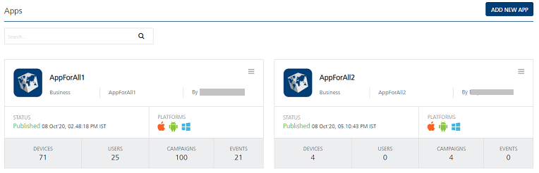
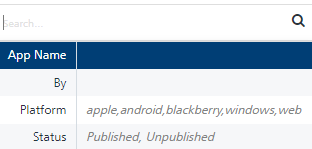
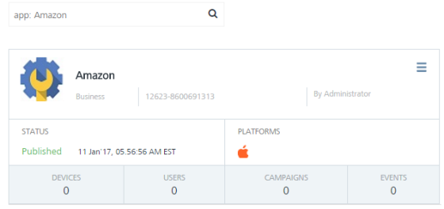
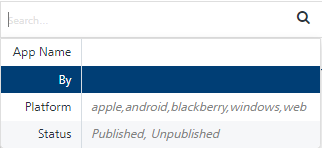
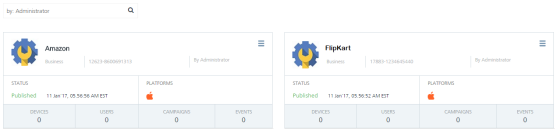
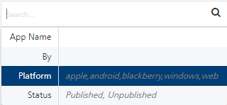
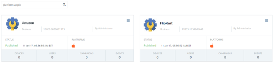
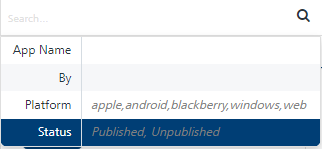
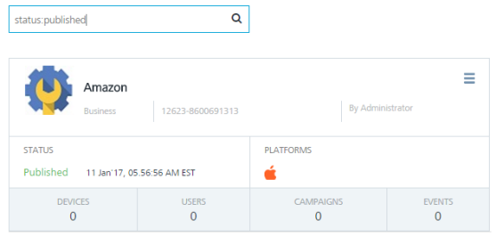
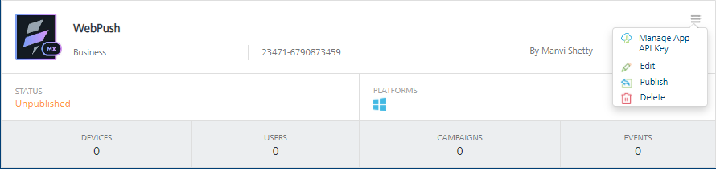

                              

Apps
====

You use mobile applications to manage different tasks for your business or organization and can download any desired app from any online app store, such as Apple App Store, and Windows Phone Store. The section explains in details about how to create, modify and configure apps and enable push notifications to apps.

> **_Important:_** To access **Engagement** services console to create, edit or delete an app, you must have the following permission to access the **Apps** screen and perform different tasks based on the role.  
-ROLE\_APPLICATIONS\_ALL

From the **Overview** section, click **Apps** from the left panel. The **Apps** home page appears.

The **Apps** home page displays the following details:

*   **Add New App** button: The button helps you add new applications to the list.
*   **Search** field: Click in the **Search** field to view options to search an app. You can search apps based on the following criteria:

*   **App**: Enter the name of the desired app in the **Search** field and click **Enter.**

       

        
The app appears on the home page.

        

        
If the specified app is not available in the app list, the system displays the message that no application is found.

        
*   **By**: Enter the name of the app's creator in the **Search** field.

        

        
The app appears on the home page.

        

        
        
*   **Platform**: Enter the required platform name in the **Search** field to view apps based on a specific platform.

        

        
A list of apps with the specified platform name appear on the home page.

        

        
*   **Status**: Enter the status as **Published** or **Unpublished** in the **Search** field.

        

        
Based on the entered status, the required apps appear on the home page.

        

        
> **_Note:_** To clear your search result, click in the **Search** field to view the **Apps** home page.
        
> **_Note:_** If no application is added into the console, the **Apps** screen displays the following message: **No Applications Found**.
        

Each app on home page displays the following details:

  
| App Elements | Description |
| --- | --- |
| Logo | Each app is associated with a logo |
| App Name | The app name appears next to the displayed logo |
| App Category, App ID and the App Creator | Below the app name you can view the app category, application ID and the name of creator who added the application |
| Platform(s) | Under platform header you can view the targeted platforms configured for the added application. For example, Apple, Android, Windows, and Web. |
| Status | Under status header, you can view the status of the application as **Published** or **Unpublished**. The published status also displays the last publication date and time |
| Devices | Under the devices header, you can view the number of devices the application is installed |
| Users | Under the users header, you can view the number of users, that have the application installed on their devices |
| Campaigns | Under the campaign header, you can view the number of campaigns associated with the application |
| Events | Under the events header you can view the number of events associated with the application. |

  
Click the icon at the top right corner of the app. A drop-down menu appears with the following functionalities.

*   **Manage App API Key**: Allows to add, modify, and delete an App API key for an app from the list.
*   **Edit**: Allows to edit an application from the list.
*   **Publish/Unpublish**: Allows to publish or unpublish an app from the list.
*   **Delete**: Allows to delete an application. You can delete only unpublished apps.
    
    
    

You can perform the following tasks from the **Apps** screen:

*   [Adding an Application](Adding_an_Application.md)
*   [Publishing/ Unpublishing an Application](Publishing_or_Unpublishing.md)
*   [Viewing an Application](Analytics.md)
*   [Modifying an Application](Modifying_an_Application.md)
*   [Deleting an Application](Deleting_Rows_from_Grid.md)
