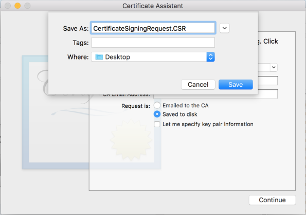

                           

Generating an Apple Push Notification Service (APNS) Certificate
================================================================

The APNS certificate is needed for the iOS devices to register with Apple to receive notifications. To generate the APNS certificate, follow these steps:

Creation of Signing Identities
------------------------------

The three different Signing Identities are:

*   [App ID](#creation-of-app-id)
*   [Certificate](#creation-of-push-apns-certificate)
*   [Provisioning Profile](#creation-of-provisioning-profile)

### Creation of App ID

1.  Login to [developer.apple.com](https://developer.apple.com/) and click on Certificates, Identifiers & Profiles
    
    
    
2.   Click on **App IDs** section.
    
    
    
3.  Click on the **+** icon which appears on the right-side of the page. Fill in the App ID Description and App ID Suffix.
    
    
    
    
    
    Here you can choose an **Explicit App ID**, which supports app specific capabilities or a **Wildcard App ID**, which doesn’t support app specific capabilities. A single Wildcard App ID can be used for different apps.
    
4.   If your choice is **Explicit App ID**, then the **App Services** section will be displayed. You can select app specific capabilities here.
    
    
    
5.   Click continue, this step will generate an **App ID** as shown.
    
    
    

### Creation of Push APNS certificate

1.  Once an App ID is created, to enable push notifications you must have a related Development or Production APNS on your Mac machine.
2.  You can now edit the App ID. You can create Push certificates for both, Development or/and Production APNS as shown below. In the following image, the app ID is enabled for both Development and Production push certificates.
    
    
    
3.  To create the certificate click **Create Certificate...**. This will redirect you to the following page.
    
    
    
4.  Follow the instructions given in the **About Certificate Signing Request (CSR)** page.
    
    Go to Keychain Access > Certificate Assistant and click **Request a Certificate from a Certificate Authority...**.
    
    
    
5.  Enter the email address and the common name in the screen below and select the option **Saved to disk**. Click **Continue**.
    
    
    
6.  In the screen below, change the file name extension in **Save As** to CSR. Click **Continue**.
7.  Once it is saved, log on to [developer.apple.com](https://developer.apple.com/) with your Developer account (Apple user ID). Click on Choose File.
    
    
    
8.  Choose the CSR file, which is saved on your machine then click Continue. This will generate the certificate as follows.
    
    
    
9.  Click **Download** to save it in your keychain.

### Creation of Team Certificate

1.  Go to the Certificates section and click the **+** symbol.
2.  You must create the team certificate for iOS development or for App store submission. Select the required option, then click on continue.
    
    
    
3.  The remaining certificate creation process is the same as described earlier for [Push APNS certificate creation](#creation-of-push-apns-certificate).
4.  Once certificate is created it looks as follows in the Apple developer account.
    
    
    

### Creation of Provisioning Profile

1.  Click on the Provisioning profile (Development/Distribution) and the click on **+**.
    
    
    
2.  Select the type of the provisioning profile required as per your usecase. Then click continue.
    
    
    
3.  Select the **App ID** for which you want to create the profile, then click continue.
    
    
    
4.  Select the appropriate **team certificate**, then click continue.
    
    
    
5.  If you are using an **Adhoc profile** then you must select the devices that are already added in your devices list. This is to register the devices with the current profile.
    
    > **_Note:_** This step is required only for adhoc profile creation.
    
    
    
6.  Click on continue. Give the **Profile name** and proceed further.
    
    
    
7.  Click on **Generate** and you can now download the profile.
    
    
