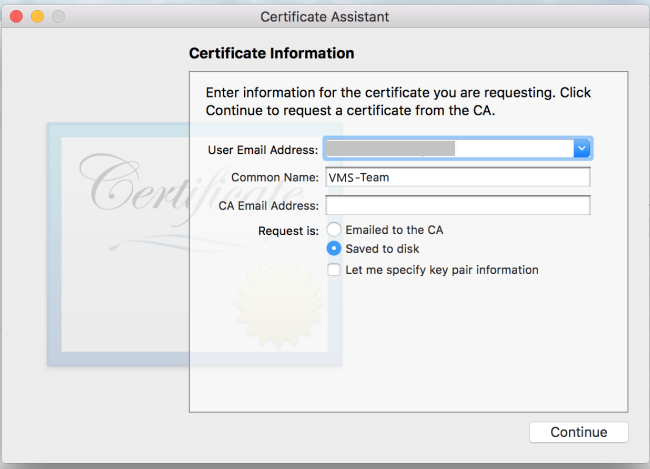
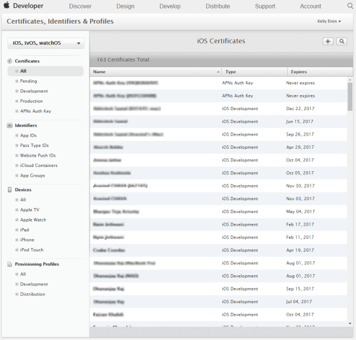
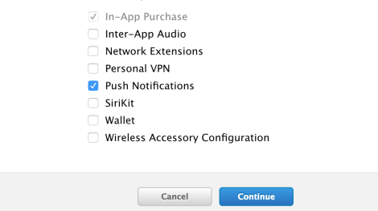
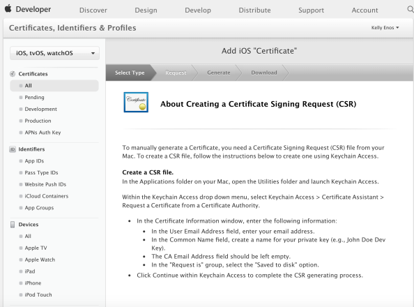

                           

Generating an Apple Push Notification Service (APNS) Certificate
================================================================

The APNS certificate is needed for the iOS devices to register with Apple to receive notifications. To generate the APNS certificate, follow these steps:

1.  The first step to generate an Apple Push Notification Service (APNS) certificate is to generate a certificate request (CSR) file. The certificate request (CSR) file is used to request a development SSL certificate. To generate a CSR file, launch the **Keychain Access** application from the LaunchPad.
    
    
    
2.  Select the **Keychain Access** > **Certificate Assistant** > **Request a Certificate From a Certificate Authority** to create an SSL certificate.
3.  Enter the email address and the common name in the screen below and select the option **Saved to disk**. Click **Continue**.
4.  In the screen below, change the file name extension in **Save As** to CSR. Click **Continue**.
5.  Click **Done** to create the CSR request and save it on your computer.
6.  Log on to the [developer.apple.com](http://developer.apple.com/) site with your Apple user ID. If you don’t have an Apple developer account, go ahead now and register with Apple.
    
    
    
7.  Click **Sign In** to continue.
8.  The next step is to craete an app ID for push notifications. On Developer Account page, click **Certificates, IDs and Profiles** in the left pane to continue. The **Certificates, Identifiers and Profiles** page appears.
    
    
    
9.  Click **App IDs** under **Identifiers** in the left pane to add a new App Id. The **iOS App IDs** page appears with a list view of existing App IDs.
    
    
    
10.  Click plus sign next to the label **iOS App IDs**.The **Register iOS App IDs** page appears.
11.  **Register iOS App IDS**: Enter the application name for the description and a bundle Id. Remember the bundle Id as it will be used to configure the application in Iris.
    
    
    
12.  Ensure that **Push Notifications** is checked under the **App Services** section. Click **Continue**.
    
    
    
13.  The screen below is the confirmation screen with all the details of the App Id that will be created. Click **Register** to continue.
    
    
    
14.  The system displays the message that App Id is confirmed. Click **Done.**
    
    
    
15.  The next few steps discuss the configuration of the **app ID** for push notifications. Select the app ID that was created.
16.  Click the application name (VMSDemoApplication in the example below) and click **Edit** to edit the information of the application Id chosen.
    
    
    
17.  In **App ID Suffix** >**App Services** section, select **Push Notifications** option to create the development and production certificates. Click **Continue**.
    
    
    
18.  To create a development certificate, click **Create Certificate** in the Development SSL Certificate section. Then, click **Done**.
    
    
    
19.  The screen below describes the steps to create the Certificate Signing Request (CSR) but as these steps are already complete, click **Continue** to move to next step.
    
    
    
20.  The next step involves choosing the **CSR** file that was generated earlier. Click **Choose File** option to upload the created request.
    
    
    
21.  Click **Generate** after the CSR file is selected to complete the certificate creation.
    
    
    
22.  Click **Done** on the display screen that shows that the certificate is created successfully.
    
    
    
23.  Select com.voltmx.vmsapplicationdemo in the iOS Certificates and click **Download** to download the certificate.
24.  Double click aps\_production.cer in the **Downloads** folder to add it to the Keychain Access application.
    
    
    
25.  To view the certificate in the **Keychain**, launch the **Keychain Assistant** and filter by certificates category. The push certificate is displayed.
    
    
    
26.  Right-click the certificate and click **Export Apple Production iOS Push Services:com.voltmx.vmsdemoapplication** to export the certificate.
    
    
    
27.  Enter the file name and the location where the file is to be saved and click **Save**.
    
    
    
28.  Enter the password and click **OK** to continue.
    
    
    
29.  Enter your admin password for your computer and click **Allow**. This will cause the certificate to be exported to the folder mentioned.
