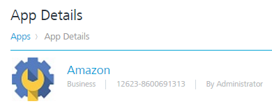
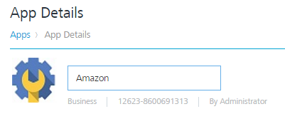
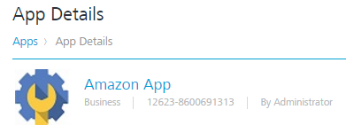
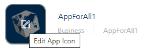
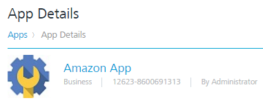

                            

Modifying Basic Details
=======================

To modify Basic details, follow these steps:

1.  In the **Applications** home screen, click the required applications from the list.
    
    The system displays the **App Details** page. By default, the **Analytics** tab is set to active.
    
    Application Name
    ----------------
    
    1.  **Application Name**: To modify the application name, click the application name.
        
        
        
        The app name opens into the editable mode.
        
        
        
    2.  Make the required changes.
        
        The updated name appears on the **App Details** page.
        
        
        
    
    Application ID
    --------------
    
    1.  **Application ID**: The field contains the system-generated unique application ID. You cannot change the application ID.
    
    App Category
    ------------
    
    1.  **App Category**: You cannot change the app category.
    
    App Icon
    --------
    
    1.  **App Icon**: If required, upload the new icon for the application. Click the existing icon.
        
        
        
        The system navigates to picture library on your system.
        
    2.  Select the required image form the location and click **Open**. The selected icon replaces the old icon.
        
        The updated app with the new logo appears on the **App Details** page.
        
        
        
    
    You can view the updated app with the new logo on the **Apps** home page.
