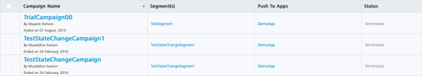

                            

Sorting data
============

Volt MX  Foundry Engagement Services allows you to sort data for all the girds quickly based on columns, For example, Campaign Name or Campaign Status. Sorting data is an important part of data analysis, when you want to arrange a list of names in alphabetical order, and collect a list of applications or events from highest to lowest order rows by status or targeted platforms. Sorting data helps you to quickly visualize and understand your data and ultimately make more effective decisions.

To sort data in a grid column, follow these steps:

1.  To sort in ascending or descending alphanumeric order, click the column header. The arrow direction in the column name indicates, if the column is sorted in ascending or descending order. The down arrow next to the column name shows that the data is descending.
    
    
