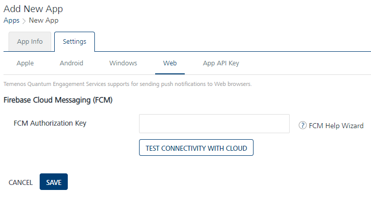

                           

Web
===

Volt MX  Engagement Server supports the sending of web push notifications using Google’s Firebase Cloud Messaging (FCM). Follow these steps to add a new application and configure settings to send web pushes.

> **_Note:_** You can send push notifications to Google Chrome, Microsoft Edge, and Mozilla Firefox Web Browsers.

**To configure the Web platform, follow these steps:**

FCM Authorization Key
---------------------

1.  **FCM Authorization Key**: Enter the **FCM Authorization Key**.
    
    > **_Note:_** Refer **[Generating Firebase Cloud Messaging (FCM) Server Key and Sender ID](Generating_Web_FCM_keys.md)** for more details on how to subscribe to FCM and get the FCM Authorization Key.You can also test the FCM authorization key for validation by clicking the **Test Connectivity** button
    
2.  Click **Test Connectivity** button to check if the **FCM** key is valid or not.  
    The system displays the confirmation message that the FCM connection test is successful.
3.  Click **Cancel**, if you do not want to add **Web** platform.
4.  Click **Save** to save the specified details.
