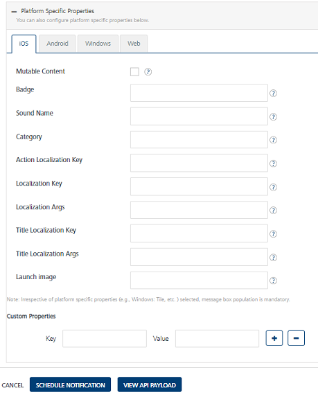
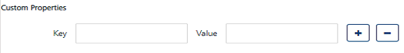

                           

iOS Platform
============

You need to specify the platform specific properties for those platforms your app supports

For Apple enter details for the following fields:

1.  **Badge**: Enter the badge number. The number is used to display the badge of the application icon. If this property is absent, the badge is not changed. To remove the badge, set the value of this property to 0.
2.  **Sound Name**: Enter the name of the sound file. The sound in this file is played as an alert. If the sound file does not exist or default is specified as the value, the default alert sound is played. The audio must be in an audio data format that is compatible with system sounds.
3.  **Category**: Provide this key with a string value to define custom actions.
4.  **Action Localization Key**: If you enter a string to specify the Action Localization Key, the system displays an alert. The string is used as a key to get a localized string in the current localization.
5.  **Localization Key:** If you enter a string to specify the Action Localization Key, the system displays an alert. The string is used as a key to get a localized string in the current localization., (which is set by the user’s language preference).The key string can be formatted with %@ and %n$@ specifiers to take the variables specified in loc-args.
6.  **Localization Args:** Variable string values to appear in place of the format specifiers in loc-key.
7.  **Title Localization Key**: The key to a title string in the Localizable.strings file for the current localization. The key string can be formatted with %@ and %n$@ specifiers to take the variables specified in the title-loc-args array.
8.  **Title** **Localization Args**:Variable string values to appear in place of the format specifiers in title-loc-key.
9.  **Launch Image**: Enter details of the launch image, which is a simple placeholder image that iOS displays when your app starts up. The launch image appears instantly and is quickly replaced by the first screen of your app.
10.  **Content Available**: Provide this key with a value of one or zero. One indicates that new content is available. This feature supports Newsstand apps and background content downloads.
11.  **Custom Properties**: Click the **Blue +** button to add the additional Key and Value pair details for custom properties.
    
    
    
12.  Click **Cancel**, if you do not want to set platform specific properties for iOS platform.
13.  Click **Save** to set platform specific properties for iOS platform.
