                             

Campaigns
=========

A campaign pertains to specific activities designed to promote a service. For example, let us assume, **Amazon** wants to run a campaign to send festive offers to their customers.

A campaign comprises segments. The segments include users who are subscribed to a particular application. For example, **Amazon** campaign includes a segment named as **Amazon Segment**. The **Amazon Segment** includes users who are subscribed to the **Amazon** app.

Based on your requirement, you can add one or more segments to a campaign. You can also define the start date and the end date, and specify messages. The **Amazon** campaign sends push notifications, email, SMS or passes to all users when the campaign starts. A campaign also periodically checks for new users and sends them messages.

From the **Engagement** section, click **Campaign**s from the left panel. The **Campaigns** page appears.

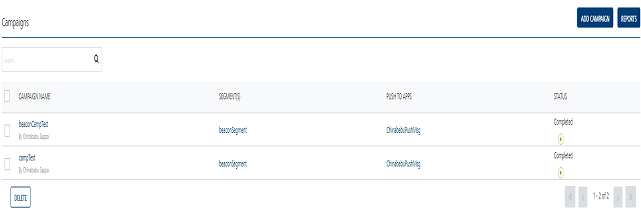

> **_Important:_** As a campaign manager, you must have the following permissions to access the Campaigns home page and perform tasks:  
  
    - ROLE\_CAMPAIGNS\_ALL  
    - ROLE\_CAMPAIGNS\_EXECUTE  
    - ROLE\_CAMPAIGNS\_TERMINATE

The **Campaigns** page displays the following details:

*   ****Add Campaign**** button: Helps you add new campaigns to the console.
*   **Reports** button: Helps you view campaign reports.
*   **Search** field: Click in the **Search** field to view available options to search for a campaign. You can search a campaign based on the following criteria:
    *   **Campaign Name**: Enter the name of the campaign and click **Enter**.
        
        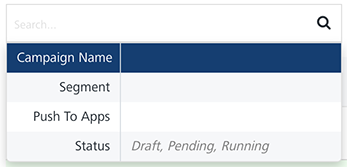
        
        The required campaign appears on the home page.
        
        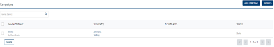
        
    *   **Segment:** Enter the name of a segment associated with a campaign and click **Enter**.
        
        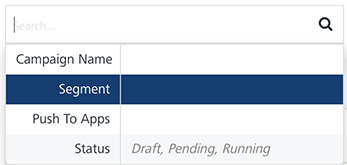
        
        The required campaign appears on the home page.
        
        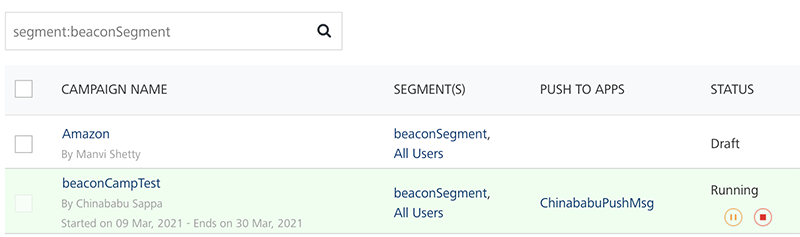
        
    *   **Push to Apps**: Enter the name of an app associated with a campaign and click **Enter**.
        
        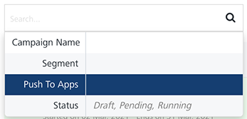
        
        The required campaign appears on the home page.
        
        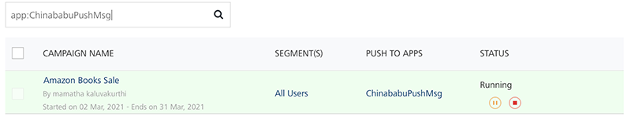
        
    *   **Status**: Enter the current status of the campaign and click **Enter**.
        
        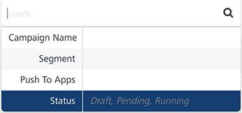
        
        The required campaign appears on the home page.
        
        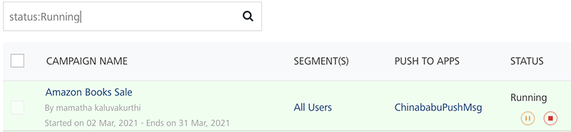
        
        > **_Note:_** To clear your search result, click in the **Search** field to view the **Campaigns** home page.
        
    *   **Searching without Labeling with Multiple Parameters**: Enter the required parameters with a space in the **Search** field. For example, the below image displays search result for four campaigns based on entered parameters.
        
        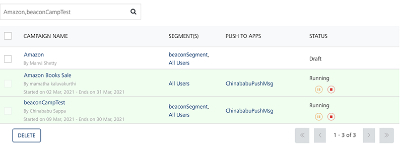
        
        > **_Important:_** If no campaign is added, the system displays the message under the **Status** column: **No campaigns found**.
        

The **Campaigns** list-view displays the following details:

  
| Campaign Element | Description |
| --- | --- |
| Campaign Name | Displays the following details:- Campaign Name: Displays the name of a campaign.- Creator: Displays the name of the campaign's creator.- Campaign Start Date and Campaign End Date: Displays the campaign start date and the end date |
| Segment(s) | Displays the names of all the segments added to the campaign. You cannot add a campaign without a segment |
| Push to Apps | Displays all the applications associated with each campaign |
| Status | Displays the status of the campaign as running, completed or terminated |
| Delete button | The button helps you delete campaigns from the list |
| Display controls | By default, the number range is set to 20 so that only 20 campaigns are displayed in the list-view. You can view more campaigns through the forward arrow icon. You can navigate back through the backward arrow icon. |

> **_Important:_** You cannot delete an active running campaign. However, you can pause a running campaign, and then delete it. To delete a campaign, the status should be DRAFT, PENDING or PAUSED. You cannot delete if a campaign status is RUNNING / TERMINATED / COMPLETED.

You can click on any Campaign to view and edit the campaign details. The **View Campaign** page shows the following error incase the **Campaign End Date** is prior to the **Campaign Start Date**.

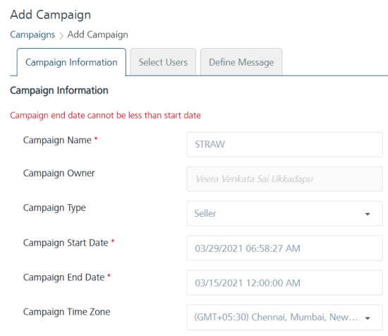

You can do following tasks from the **Campaigns** page:

*   [Adding Campaigns](Adding_a_Campaign.md)
*   [Pending Campaigns](Pending_Campaigns.md)
*   [Pausing Campaigns](Pausing_a_Campaign.md)
*   [Resuming Campaigns](Resuming_a_Campaign.md)
*   [Setting Message Priority](Setting_Message_Priority.md)
*   [Modifying Campaigns](Modifying_a_Campaign.md)
*   [Stopping/Terminating Campaigns](Terminating_a_Campaign.md)
*   [Restarting Campaigns](Restarting_a_Campaign.md)
*   [Viewing Campaign Reports](Viewing_Campaign_Reports.md)
*   [Deleting Campaigns](Deleting_a_Campaign.md)
