                             

Push Message
============

To configure your campaign message, you can use a pre-defined template or create a new push message for a campaign. You can do the following tasks from the Add Campaign > Define Message section:

*   [Adding a Push Message](#adding-a-push-message)
*   [Modifying a Push Message](Modifying_a_Push_Message.md)
*   [Deleting a Push Message](Deleting_a_Push_Message.md)

Adding a Push Message
---------------------

To add a push message for a campaign, follow these steps:

1.  **Select Message Channels**: Select the type of notification as **Push Message**.
    
    The **Push Message** grid appears. The push message grid includes a push message label and the compose message button to compose push messages. If no push message is found, the system displays the message: No message configured.
    
    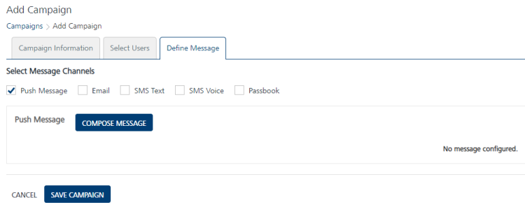
    
2.  Click the **Compose** **Message** button to compose a new push message for a campaign.
    
    The **Compose Message** drop-down window appears.
    
    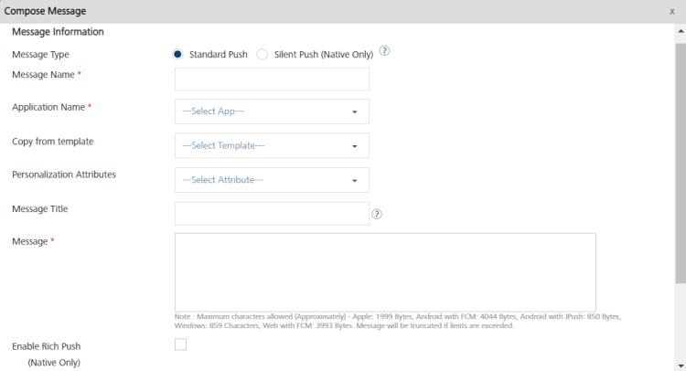
    
    The **Compose Message** window includes Message Information section to add a new push message. You can define a push message with following options:
    
    *   [Silent Push](#silent-push)
    *   [Standard Push](#standard-push)
    *   [Copy from Template](#copy-from-template)
    
    By default, the message type option is set to standard push.
    
    Silent Push
    -----------
    
    1.  **Silent Push**: Select the silent push option.
        
        > **_Note:_** The standard push notifies the user when a device receives a push notification. The silent push does not notify the end-user.On iOS, a silent push will wake the app only if it is already present in the background or was terminated by the OS due to a memory shortage. If the user terminates the app, the silent push is not respected and no app code is activated. For more information, refer [Background Execution](https://developer.apple.com/library/archive/documentation/iPhone/Conceptual/iPhoneOSProgrammingGuide/BackgroundExecution/BackgroundExecution.md).
        
        The **Compose Message** window displays applicable fields: message name, application name, and the platform specific properties.
        
        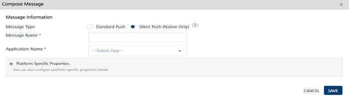
        
        1.  **Message Name**: Enter an appropriate name for the push message.
        2.  **Application Name**: Select the required application from the drop-down list.
            
            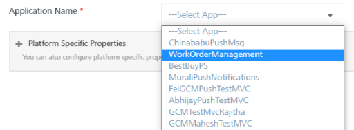
            
        3.  **Platform Specific Properties**: To add platform specific properties follow these steps:
            *   Click the plus + icon next to Platform Specific Properties label.
                
                The system displays four tabs for iOS, Android, Windows, and Web platforms. By default, the iOS platform tab is set to active.
                
                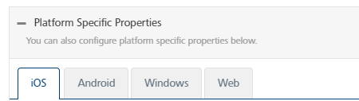
                
                To configure platform specific properties refer, [Platform Specific Properties](#platform-specific-properties)
                
                > **_Important:_** Only iOS and Android devices are supported for silent push. When a silent push message is sent to Android devices, the app for which the push is sent is launched in the background (if it is not already running) before the silent push is processed. This causes the creation of a session.  
                  
                For the iOS devices, when a silent push is received and the app for which the message is sent is not running (because the app is killed by the user), then the message is not processed and no session is created.  
                  
                For the iOS devices, when a silent push is received and the app for which the message is sent is not running (because the app is killed by the device due to a lack of resources or something similar), then the message is processed by launching the app in the background and a session is created.
                
    
    ### Standard Push
    
    By default, the **Message Type** option is set to **Standard Push**.
    
    The **Compose Message** window displays applicable fields: message type, message name, application name, and copy from template, personalization attributes, message title, message, enable rich push, and platform specific properties.
    
    **To compose a standard push message, follow these steps**:
    
    1.  **Message Name**: Enter an appropriate name for the push message.
    2.  **Application Name**: Select the required application from the drop down list.
        
        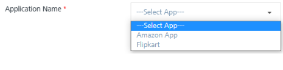
        
    3.  **Personalization Attributes**: Select the attributes from the drop-down list to customize your campaign message.
        
        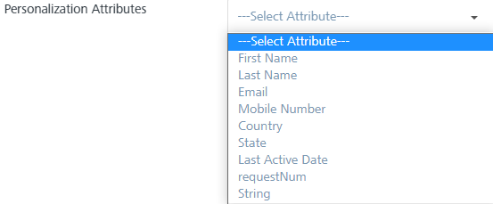
        
        The system inserts the selected attributes at the cursor position in the **Message Box** text area.
        
        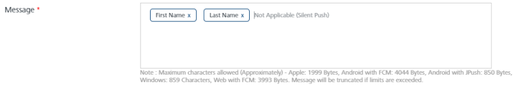
        
    4.  Based on your requirement, place the cursor in the message box to insert personalization attributes and push message. You can click X icon next to each attribute to remove the attribute from the message box.
    5.  **Message Title**: Enter an appropriate title to the push message.
    
    ### Copy from Template
    
    **To copy from a template, follow these steps**:
    
    1.  **Message Name**: Enter an appropriate name for the push message. The name should be indicative of what the message contains.
    2.  **Application Name**: Select the application from the Application Name drop-down list to associate with the push message.
    3.  **Copy from Template**: To create a new push message from a template, select the required template from the drop-down list.
        
        The **Select Template** drop-down list appears.
        
        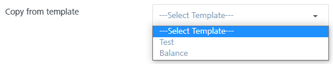
        
        The associated attributes and message, if any with the selected template appears in the Message Box.
        
    4.  **Message Title**: The Message Title automatically gets populated from the Push Template you select.  
        If there is no Message Title associated with the Push Template, enter an appropriate title.
    5.  **Personalization Attributes**: You can select the personalization attributes from the drop-down list to customize the push message. The selected attributes appear in the Message Box.
        
        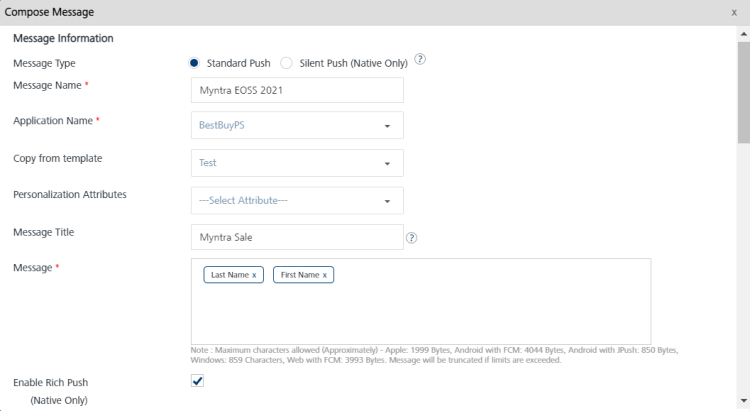
        
    
    > **_Important:_** Only iOS and Android devices are supported for standard push messages.  
    When a standard push message is sent to Android devices, the app for which the push is sent is launched in the background (if it is not already running) before the standard push message is processed, This causes the creation of a session.  
      
    When a standard push message is sent to iOS devices, the push message is displayed by the platform and no session is created.
    
    ### **Enable Rich Push**
    
    **To enable rich push content option follow these steps**:
    
    1.  **Enable Rich Push**: Select the checkbox to associate the rich push.
        
        The **Compose Message** window displays applicable fields: compose from template drop-down list, personalization attributes drop-down list and the rich content text box.
        
        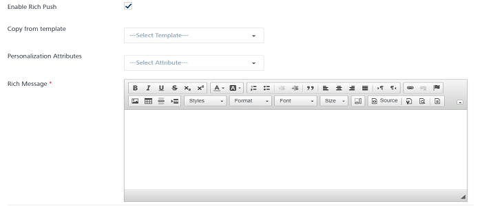
        
        *   **Personalization Attributes**: Select the desired attributes from the drop-down list.
            
            The selected personalization attributes appear in the rich content text box.
            
        *   **Copy from Template**: Select the required template from the drop-down list.
            
            The selected template with rich content appears in the rich content text box.
            
            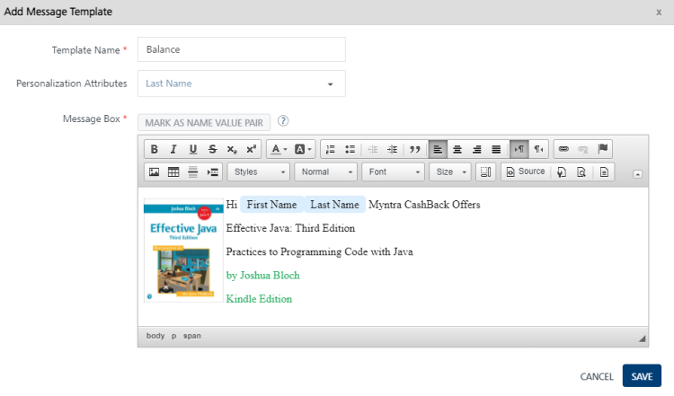
            
            To know more about key-value pair attributes refer, [Entering Attributes Values](Entering_Value_for_the_Attributes.md)
            
            *   **Rich Message**: Enter your content. Use the text tool bar to customize the content.
                
                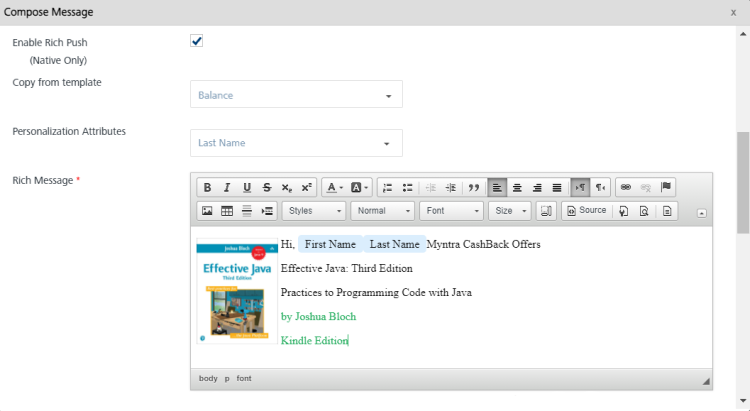
                
    
    ### Platform Specific Properties
    
    To add platform specific properties, follow these steps:
    
    1.  Click the plus + icon next to Platform Specific Properties label.
        
        The system displays four tabs for iOS, Android, Windows, and Web platforms. By default iOS tab is set to active.
        
        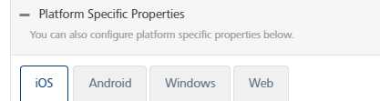
        
    2.  To configure platform specific properties, click the respective link below:
        *   [iOS](camppushios.md#ios-platform)
        *   [Android](camp_push_android.md)
        *   [Windows](camp_push_window7and8.md)
        *   [Web](camp_push_Web.md)
3.  Click the **Cancel** button, if you do not want to save the composed message. The system displays the **Add Campaign** screen.
4.  Click **Save** to save the composed message. The saved push message appears in the push message list-view under the **Define Message** tab on the **Add Campaign** home page.
    
    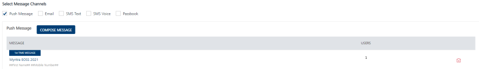
    
    The push message list view displays the following details:
    
    | Push Message Element | Description |
    | --- | --- |
    | Message | \- Label: Displays the current status of the push message as first time message or repeat message- Push Message Name: Displays the push message name- Displays the push message text |
    | Users | Displays the total number of users associated with push messages |
    | Delete button | The button helps you delete a push message |
    
    > **_Important:_** You can enter unlimited characters for the campaign message. However, when the push message is sent to any cloud, the number of characters accepted by the cloud depends on the platform:  
    \- Apple: 1999 Bytes  
    \- Android with FCM : 4044 Characters  
    \-Android with JPush: 850 Bytes  
    \- Windows: 859 Characters  
    \-Web with FCM: 4044 Characters
    
5.  The following options can be set when you add a push message in the list-view:
    1.  **Repeat Message**: By default, the repeat message option is set to **No**. To repeat a push message, select the option as Yes from the Repeat Message drop-down list.
        
        
        
    2.  **Duration**: Select the duration for the push message from the drop-down list such as, immediate, hours, days or weeks. Next, enter the duration in numbers such as 10 days or 10 weeks.
        
        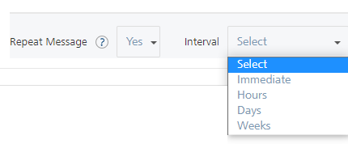
        
        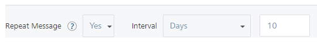
        
        > **_Important:_** The immediate option regularly monitors the user updates and sends push notifications to the user. For example, a campaign includes a segment with location attributes. When a user enters the specified geofence, the user falls in to the segment. So the campaign gets triggered immediately, and the user receives the push notification.
        
    3.  **Repeat Same Message**: Based on your requirement, select the option as **Yes** or **Different Message**. If you select Yes, then the same push message is repeated again for the campaign.  
        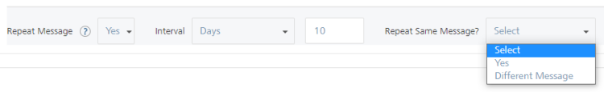  
        
        If you select the option as **Different Message**, then the **Compose Message** window appears to create a new push message. For more details about how to create a new push message, see [Compose Message](#Compose_Message_)  
        
6.  Click the **Cancel** button, if you do not want to save the new campaign. The system displays the Campaigns home screen.
7.  Click **Save Campaign** to save the campaign. The saved campaign appears in the Campaigns list view with the confirmation message that campaign is saved successfully.
