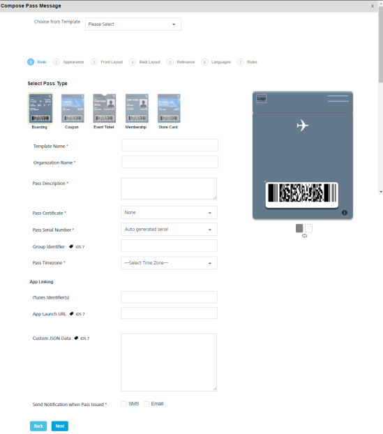

                            

Passbook
========

Passbook notifications can be used to send coupons, boarding passes, event tickets or even gift cards through campaign messages. You can do the following tasks from the Add Campaign > Define Message section:

*   [Adding a Passbook Message](#adding-a-passbook-message)
*   [Modifying a Passbook Message](#modifying-a-passbook-message)
*   [Deleting a Passbook Message](#deleting-a-passbook-message)

Adding a Passbook Message
-------------------------

To compose a Passbook message for a Campaign, follow these steps:

1.  **Select Message Channels**: Select the type of notification as **Passbook**.
    
    The **Passbook Message** grid appears. The passbook message grid includes a passbook label and the compose pass button to send pass messages. If no pass message is found , the system displays the message: No pass configured.  
      
    
    
2.  Click the **Compose Pass** button to compose a new pass message for a campaign. The compose pass message drop-down window appears. You can create a pass through following options:
    
    *   [Compose New Pass](#compose-new-pass)
    *   [Compose from Template](#compose-from-template)
    
    ### Compose New Pass
    
    To compose a new pass, follow these steps:
    
    1.  Based on your requirement, you can create the pass message. To know more about how to create a pass message, see [Adding a Passbook Template](../PassBook_Template/Passbook_Template.md#dding_a_Passbook_Template)
        
        
        
        ### Compose from Template
        
        1.  **Creating from existing template**: Select the required template from the Compose from template drop-down list. The selected **Pass Type Template** appears on the screen.
            
            
            
            Based on your requirement, you can update the existing template. To know more about how to update an existing template, see [Adding a Passbook Template](../PassBook_Template/Passbook_Template.md#dding_a_Passbook_Template)
            
3.  Click the Cancel button to close the window without saving any settings. The system displays the **Add Campaign** screen.
4.  Click the **Save** button to save the settings. The newly added pass appears in the pass list- view on the Add Campaign page.
    
    
    

Modifying a Passbook Message
----------------------------

The feature allows you to view or edit a passbook message. The View Campaign page displays the following details:

  
| Pass Message Element | Description |
| --- | --- |
| Compose Pass button | The button helps you compose a new pass message |
| Message | Displays the pass message details |
| Open/Sent | Displays the number of pass messages opened or sent |
| Delete button | The button helps you delete a pass message |
| Pause button | The button helps you pause a campaign |
| Stop button | The button helps you stop a campaign |
| Cancel button | The button helps you cancel any changes in a campaign |
| Update button | The button helps you update a campaign |

To view or modify a passbook message, follow these steps:

1.  In the **View Campaign** screen, under the **Pass** column, click the required pass message name in the list view.
    
    
    
    The **Compose Pass Message** drop-down window appears.
    
2.  Based on your requirement, create a new pass message or **Create from Existing Template**
3.  Based on your requirements, do the necessary changes. For more details, see [Modifying a Passbook Template](../PassBook_Template/Passbook_Template.md#Modifyin)
4.  Click the **Cancel** button to close the window without saving any changes. The system displays the **View Campaign** screen.
5.  Click **Update**. The updated pass appears in the pass message list-view on the View Campaign screen.

Deleting a Passbook Message
---------------------------

As an administrator, you can delete any pass message as required.

To delete a passbook message, follow these steps:

1.  To remove a passbook, select the **Delete** button in the list-view.
    
    
    
2.  The **Confirm Delete** message appears, asking if you want to delete the selected campaign message.
3.  Click **Cancel**. The **Confirm Delete** dialog closes without deleting any pass message.
4.  Click Ok to continue.
    
    The pass message is removed from the list-view.
    
    > **_Important:_** A pass does not have repeat configuration. To send a repeat pass, you can update the same pass and Engagement services handles the delivery of updated pass automatically.
