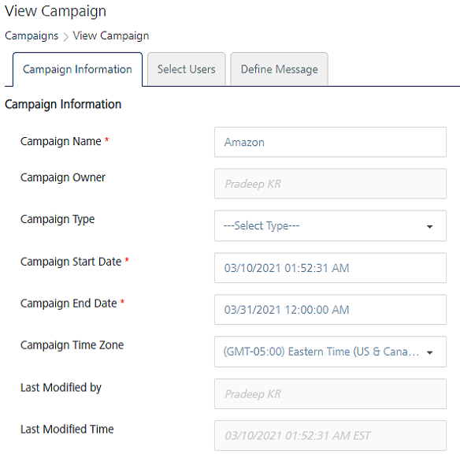
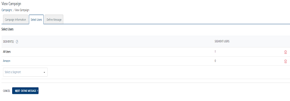
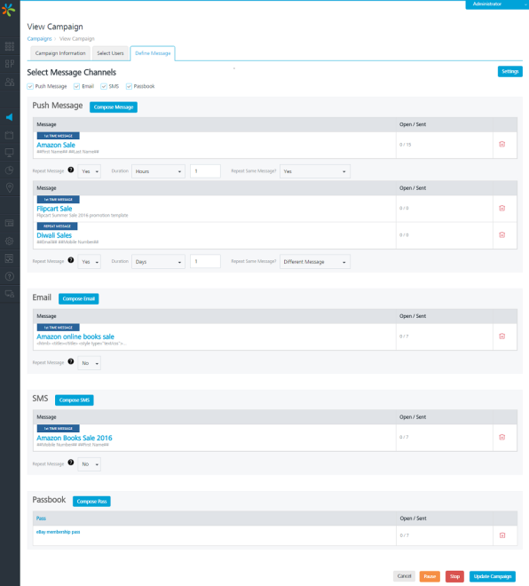

                              

Modifying a Campaign
====================

Based on your requirement, you can update a campaign’s details. You can also update the details of a running campaign.

To view or modify a campaign, follow these steps:

1.  In the **Campaigns** screen, under the **Campaign Name** column, click the required campaign link to view or edit.
    
    The **View Campaign** screen appears. The **View Campaign** screen includes the three tabs: **Campaign Information**, **Select Users** and **Define Message**. By default, the Campaign Information tab is set to active.
    
    *   [Campaign Information](#campaign-information)
    *   [Select Users](#select-users)
    *   [Define Message](#define-message)
    
    Campaign Information
    --------------------
    
2.  Based on your requirement, you can edit the following fields:
    
    
    
    | Campaign Element | Description | Modification Allowed |
    | --- | --- | --- |
    | Campaign Name | Campaign name | Yes |
    | Campaign Owner | This field contains the name of the campaign owner who created the campaign | No |
    | Campaign Type | Type of the campaign, such as business | Yes |
    | Campaign Start Date | Date and time on which the campaign starts | Yes |
    | Campaign End Date | Date and time on which the campaign ends | Yes |
    | Campaign Time Zone: | Time Zones are a geographical world globe division starting at Greenwich, in England. You can set a time zone for times and dates according to your locale | Yes |
    | Last Modified by | A user name that shows who last modified the campaign | No |
    | Last Modified Time | Time when the campaign was last modified | No |
    
3.  Click **Next - Select Users** to continue.
    
    Select Users
    ------------
    
4.  The Select Users screen appears. Based on your requirement, select the segment from the **Select a Segment** drop-down list or add a new segment.
    
    
    
5.  Click **Next -Define Message** to continue.
    
    Define Message
    --------------
    
6.  The **Define Message** screen appears. Based on your requirement, include new channels or update the existing message details.
    
    
    
7.  Click **Update Campaign** to continue. The updated campaign appears in the Campaigns list-view on the Campaigns screen. The system displays the confirmation message that the campaign is updated successfully.
