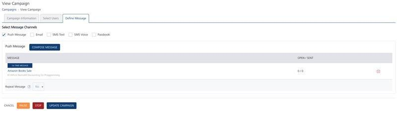
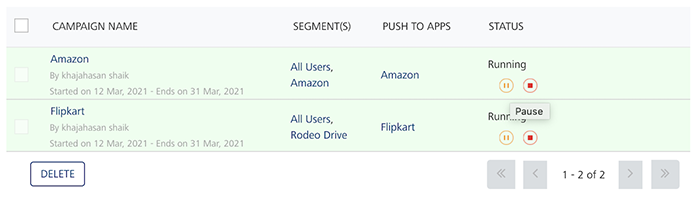
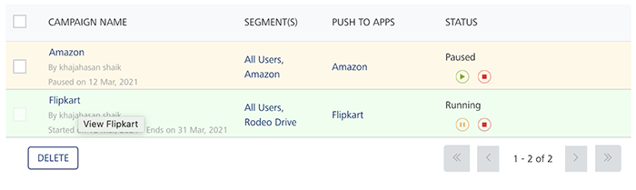

                           

Pausing Campaigns
=================

You can pause a campaign either from the Campaigns home page or from the View Campaign > Define Message page. To start a campaign again, you need to change the current campaign status from paused to resume.

To pause a campaign from Campaigns home page, follow these steps:

1.  On Campaigns home page, in the Campaigns list view, hover the mouse over the required campaign under the Status column.
    
    The system displays the Pause button.
    
    
    
2.  Click the **Pause** button.
    
    The system displays the Pause Campaign alert message, asking if you want to pause the campaign.
    
3.  Click **Cancel**, if you do not want to pause the campaign. The system closes the pause campaign alert message and returns to Campaigns home page.
4.  Click **Yes** to continue.
    
    The system displays the confirmation message that the campaign is paused successfully. The color and the status of the paused campaign changes in the list-view.
    
    
