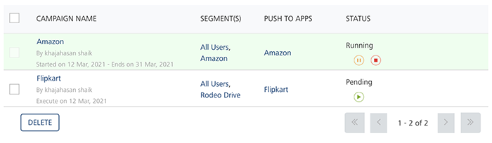
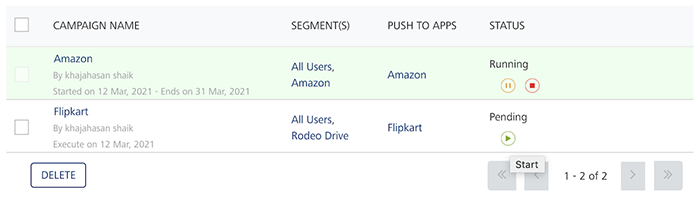
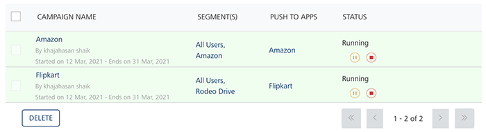

                           

Pending Campaigns
=================

A campaign whose start date is in future and has not started running obtains pending status in the Campaigns list-view. You can change a campaign's start date any time before it is reached.

To run a pending campaign, follow these steps:

1.  On Campaigns home page, in the Campaigns list view, hover the mouse over the required campaign under the Status column.
    
    The system displays the **Start** button.
    
    
    
2.  Click the **Start** button.
    
    The system displays the **Start Campaign** alert message, asking if you want to execute the campaign before the start date.
    
3.  Click **Cancel**, if you do not want to start the campaign before the start date. The system closes the start campaign alert message.
4.  Click **Yes** to continue.
    
    The system displays the confirmation message that the campaign execution initiated successfully. The color and the status of the pending campaign changes in the list-view.
    
    
