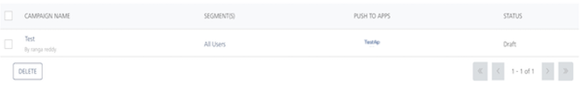

                           

Restarting Campaigns
====================

You can restart a campaign from the Campaigns home page, which redirects you to the `View Campaign > Campaign Information` page.

> **_Note:_** You can only restart the campaigns that are in the Terminated or Completed state.

To restart a campaign from the Campaigns home page, follow these steps:

1.  On Campaigns home page, in the Campaigns list view, click the **Restart** button for the required campaign under the Status column.
    
    
    
    The page redirects you to the `View Campaign > Campaign Information` page.
    
2.  Configure the required fields and click **Next - Select Users** to navigate to the **Select Users** screen. For more information, refer [Campaign Information](Modifying_a_Campaign.md#campaign-information).
3.  Select the users you want to send the campaign to and click **Next - Define Message** to navigate to the **Define Message** screen. For more information, refer [Select Users](Modifying_a_Campaign.md#select-users).
4.  Choose the notification type and compose a campaign message. For more information, refer [Define Message](Modifying_a_Campaign.md#define-message).
5.  Click the **Restart Campaign** button to restart your campaign.
