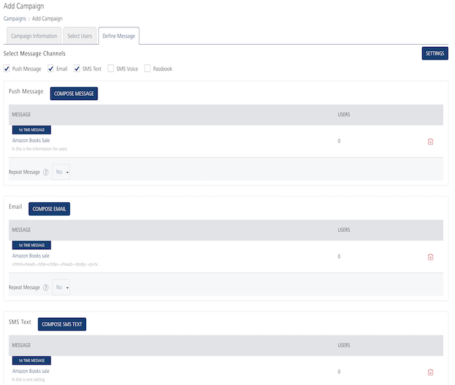
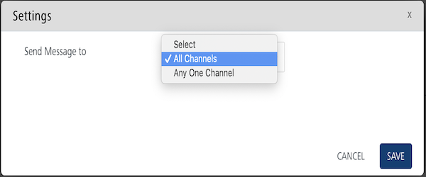
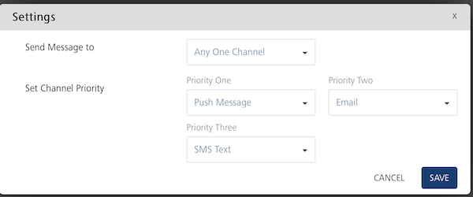

                           

Setting Message Priority
========================

You can set channel priority to send messages to users through the **Settings** button available on **Campaign** > **Define Message** page. The **Settings** button becomes active when you select at least two channels. There are four options available to send messages to users: **push message**, **email**, **SMS**, and **Passbook.**

**To set message priority, follow these steps**:

1.  Based on your requirement, select the channels from the **Define Message** page.
    
    The **Settings** button becomes active.
    
2.  Click the **Settings** button.
    
    The **Settings** window appears on the page. By default, the **Send Message to** drop-down list is set to **All Channels**.  
      
    
    
3.  Select the option as **All Channels** or **Any One Channel**.
4.  **All Channels**: The message is sent to all the channels without any channel priority. Click **Save** to continue. The system displays the Define Message page.
5.  **Any One Channel**: The **Set Channel Priority** drop-down list appears for the respective channels.
    
    
    
6.  Based on your requirement, set the channel priority for the respective channels as priority one, priority two, and the priority three.
7.  Click **Save** to continue. The system displays the **Define Message** page.
