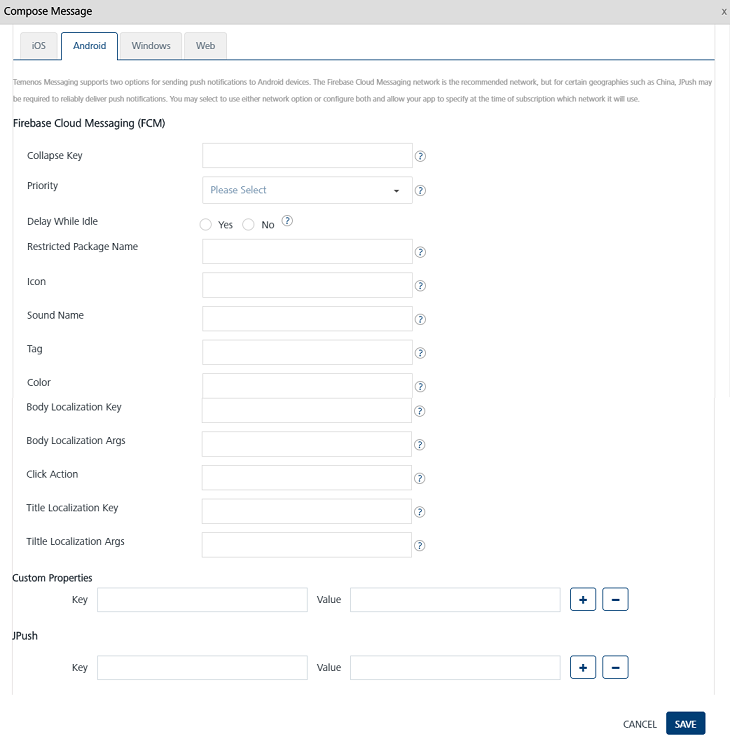
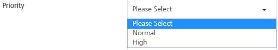

                           

Android Platform
================

Following is a list of the platform-specific properties for Android. You need to provide the values for the properties as required.

For Android devices, enter details for the following fields:

**Firebase Cloud Messaging (FCM)**
----------------------------------

The description of the properties is as follows:

1.  **Collapse Key**: Enter the collapse key. The collapse key parameter identifies a group of messages (for example, with collapse\_key: updates available) that can be collapsed, so that only the last message is sent when delivery resumes. The feature helps you avoid sending the same messages when the device becomes active.
2.  **Priority**: Select the priority of the message as **Normal** or **High** from the drop-down list. By default, the messages are sent with normal priority. The normal priority optimizes the client app's battery consumption. Select the priority as **High** only when an immediate delivery is required.
    
    
    
3.  **Delay While Idle**: Based on your requirement, select the option as **Yes** or **No**. The option indicates that the message should not be sent until the device becomes active.
4.  **Restricted Package Name**: Enter the restricted package name. The restricted package name parameter specifies the package name of the application where the registration tokens must match to receive the message.
5.  **Icon**: Enter details of the icon. The icon parameter indicates the notification icon.
6.  **Sound Name**: Enter the name of the sound file. The sound name parameter indicates a sound to play when the device receives the notification. The feature supports the default sound or a sound resource bundled in the app.
7.  **Tag:** Enter the tag details. The tag parameter indicates whether each notification message results in a new entry in the notification center on Android. If the parameter is not set, then each request creates a new notification.  
    If the tag parameter is set, a notification that the same tag is already displayed appears. The new notification replaces the existing one in the notification center.
8.  **Color**: Enter the color code. The color parameter indicates the color of the icon, expressed in the #rrggbb format.
9.  **Body Localization Key:** Enter the body localization key. The body localization key parameter indicates a key to the body string (meant for localization).
10.  **Body Localization Args**: Enter the **Body Localization Args**. The body localization args are comma-separated string values to replace format specifiers in the body string for localization.
11.  **Click Action**: The click action is associated with a user who clicks a notification.
12.  **Title Localization Key**: Enter the title localization key. The key to the title string for localization.
13.  **Title Localization Args**: Enter the title localization args. The title localization args are comma-separated string values to replace the format specifiers in the title string for localization.
    
    ### Custom Properties
    
14.  Key: Enter the key.
15.  Value: Enter a value for the key-value pair.
16.  Click the blue plus button to add the additional **Key** and **Value** pair details.
17.  Click the blue minus button to remove the added **Key** and **Value** pair details.

JPush
-----

1.  Key: Enter the key.
2.  Value: Enter the value.
3.  Click the blue plus button to add the additional **Key** and **Value** pair details.
4.  Click the blue minus button to remove the additional **Key** and **Value** pair details.
5.  Click **Cancel** to close the window.
6.  Click **Save** to save the platform details.

> **_Note:_** For Android, platform-specific property values are sent in an encoded format. An application developer needs to decode the values before displaying the message on the device.
