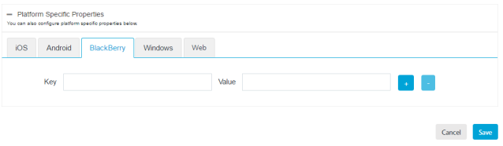

                           

BlackBerry Platform
===================

You need to specify the platform-specific properties for those platforms that your app supports.

For **BlackBerry** devices, enter details for the following fields:

1.  Key: Enter the key.
2.  Value: Enter the value.
3.  Click the blue plus button to add the additional key-value pair details.
4.  Click the blue minus button to remove the additional key-value pair details.
5.  Click **Cancel** to close the window.
6.  Click **Save** to save the platform details.
