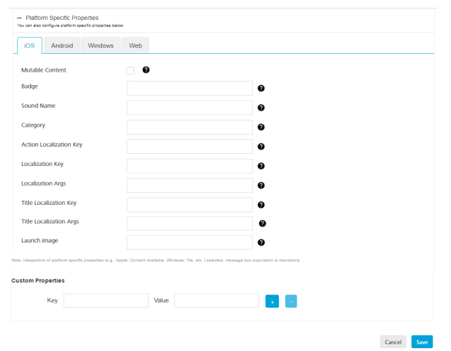
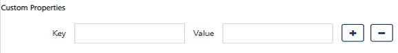

                           

iOS Platform
============

You need to specify the platform-specific properties for those platforms that your app supports.

For Apple devices, enter details for the following fields:

1.  **Badge**: Enter the badge number. The number is used to display the badge of the application icon. If this property is absent, the badge is not changed. To remove the badge, set the value of the property as 0.
2.  **Sound Name**: Enter the name of the sound file. The sound in the file is played as an alert. If the sound file does not exist or a default is specified, as the value, the default alert sound is played. The audio must be in an audio data format that is compatible with the system sounds.
3.  **Category**: Provide the key with a string value to define custom actions. This is a new feature of iOS8. The **Category** feature is used to develop interactive notifications, such as **Invite**, **New Mail**, and **Tagged**.
4.  **Action Localization Key**: Enter a string to specify the **Action Localization Key**. The string is used as a key to get a localized string based on the current localization.
5.  **Localization Key:** Enter the string. The string is a key to an alert message string in the `Localization` string file in the device for the current localization (that is set by the user’s language preference). The key string can be formatted with `%@` and `%n$@` specifiers to take the variables specified in `locArgs`.
6.  **Localization Args:** Enter the string. The comma separated variable string values that must appear in place of format specifiers in the title loc-key.
7.  **Title Localization Key**: Enter the string. The key to a title string in the localizable strings file for the current localization. The key string can be formatted with %@ and %n$@ specifiers to take the variables specified in the title-loc-args array.
8.  **Title** **Localization Args**:  Enter the string. The variable string value appears in place of the format specifiers in the title-loc-key.
9.  **Launch Image**: Enter details of the launch image, which is a simple placeholder image that iOS displays when your app starts up. The launch image appears instantly and is quickly replaced by the first screen of your app.
10.  **Custom Properties**: Based on your requirement, add the key-value pair for the custom properties. Click the blue plus button to add the additional **Key** and **Value** pair details for the custom properties.
    
    
    
11.  Click the blue minus button to remove the added key-value pair fields from the custom properties.
12.  Click **Cancel** if you do not want to set platform-specific properties for iOS platform.
13.  Click **Save** to set platform-specific properties for iOS platform.
