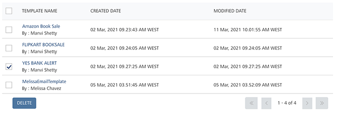

                           

Deleting Email Templates
========================

As an administrator, you can delete an email message template as required.

To delete an email message template, follow these steps:

1.  Select the required templates in the list-view.
2.  Click the **Delete** button.
    
    
    
    The system displays the **Confirm Delete** dialog asking if you want to delete the selected email template.
    
3.  Click **Cancel** if you do not want to delete the email template.
4.  Click **Ok** to continue.
    
    The system displays the confirmation message that the template deleted successfully. The deleted template is no longer displayed in the templates list-view.
