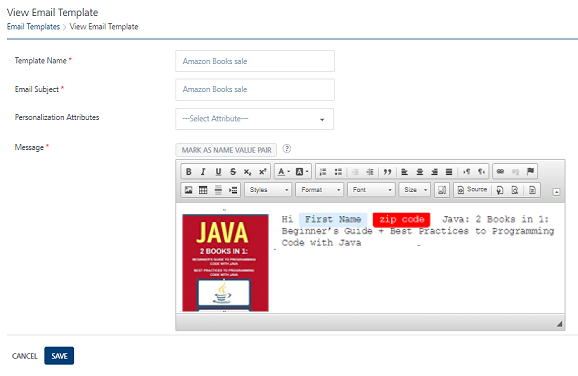
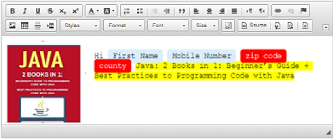

                            

Modifying Email Templates
=========================

The feature allows you to view and change the email message templates. For example, you want to modify the personalization attributes.

To view or modify an email message template, follow these steps:

1.  Click the required template in the **Email Template** list- view.
    
    The **View Email Template** page appears.
    
    
    
2.  You can update the following fields
    
    | Email Message Template Element | Description | Modification Allowed |
    | --- | --- | --- |
    | Template Name | Email message template name | Yes |
    | Email Subject | Email subject text | Yes |
    | Personalization Attributes | There are default personalization attributes: First name, Last name, Email, Mobile number, Country, and State | Yes |
    | Mark as Name Value Pair | A key-value pair is a set of two linked data items: a key, which is a unique identifier for a data type, and its value: the data such as, county:Iowa, state: wisconsin | Yes |
    
    The added details appears in the message box window.
    
    
    
3.  Click the **Cancel** button to exit from the window without saving any information.
4.  Click the **Update** button to save the modifications.
    
    The updated email message template appears in the list-view. The system displays the confirmation message that the template updated successfully.
