                             

SMS
===

To configure your SMS message, you can use an SMS template or create a new event SMS. You can perform the following tasks from the **Add Event** > **Define Message** section:

*   [Adding an SMS Message](#adding-an-sms-message)
*   [Modifying an SMS Message](#modifying-an-sms-message)
*   [Deleting an SMS Message](#deleting-an-sms-message)

Adding an SMS Message
---------------------

To add an SMS message for an event, follow these steps:

1.  **Select Message Channels**: Select the type of notification as **SMS**.
    
    The **SMS Message** grid appears. The SMS message grid includes an SMS label and the **Compose SMS** button to compose SMS messages. If no SMS message is found, the system displays the message: **No SMS configured**.
    
    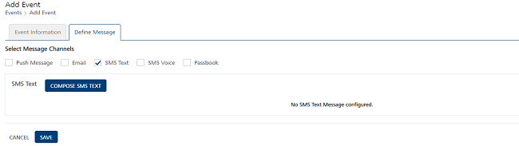
    
2.  Click the **Compose SMS** button to create a new **SMS message** for a campaign.
    
    The **Compose SMS Message** window appears.
    
    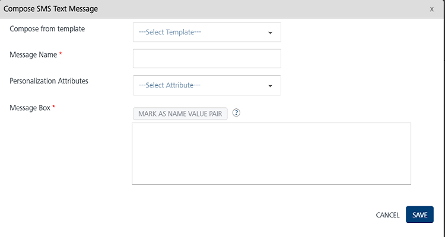
    
    You can create an SMS message through the following options:
    
    *   [Compose New SMS](#compose-new-sms)
    *   [Compose from Template](#compose-from-template)
        
        ### Compose New SMS
        
        To compose a new SMS, follow these steps:
        
        1.  **SMS Message Name**: Enter the message name in the **SMS Message Name** field.
        2.  **Personalization Attributes**: Select the required personalization attributes from the drop-down list.
            
            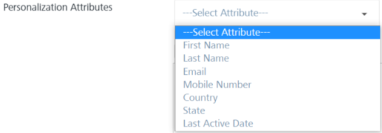
            
            The system inserts the selected attributes at the cursor position in the **Message Box**.
            
        3.  Based on your requirement, place the cursor in the **Message Box** to insert personalization attributes and the SMS message. You can click the X icon next to each attribute to remove the attribute from the message box.
            
        4.  **Mark as Name Value Pair**: To set the name\_value pair, enter the keywords in the **Message Box** and then click the **Mark as Name Value Pair** button. The marked text is highlighted to indicate that the text has been converted to a variable.
            
            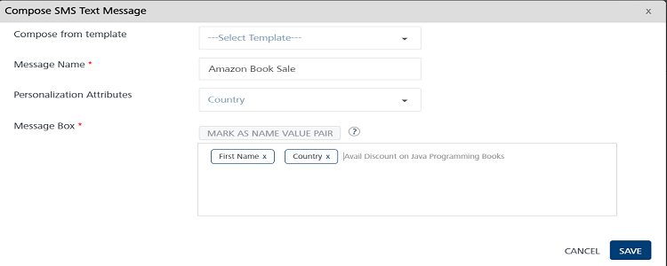
            
        
        ### Compose from Template
        
        To compose an SMS message from an existing template, follow these steps:
        
        1.  **Compose from Template**: To create a new SMS message from a template, select the required template from the drop-down list.
            
            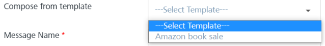
            
            The associated attributes and message with the selected template appear in the **Message Box**.
            
            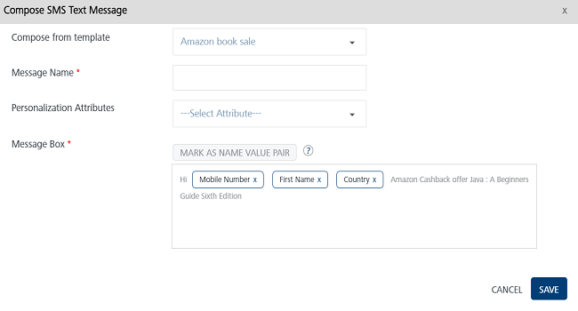
            
        2.  **SMS Message Name**: Enter an appropriate name of the SMS message.
        3.  **Personalization Attributes**: Select the personalization attributes from the drop-down list to customize the SMS template.
            
            The selected attributes are appended in the message box.
            
            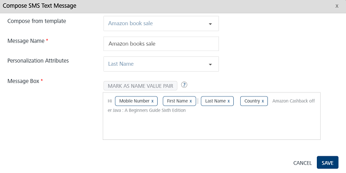
            
        4.  Based on your requirement, place the cursor in the **Message Box** to insert personalization attributes and SMS message. You can click X icon next to each attribute to remove the attribute from the **Message Box**.
        5.  Click the **Cancel** button to close the window. The system displays the **Add Event** screen.
        6.  Click the **Save** button. The newly added SMS appears in the **SMS Message** list-view on the **Add Event** screen.
        
        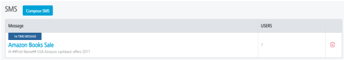
        
        The SMS message list-view displays the following details.
        
        | SMS Message Element | Description |
        | --- | --- |
        | Message | \- Displays the SMS message name- Displays the SMS message text |
        | Open / Sent | Displays the total number of SMS messages sent and opened by users |
        | Delete button | The button helps you delete SMS messages |
        
3.  Click the **Cancel** button if you do not want to save any updates. The system displays the **Events** home screen.
4.  Click **Save** . The event appears in the list-view. The system displays the confirmation message that the event is saved successfully.

Modifying an SMS Message
------------------------

You can manage SMS message details. You may need to modify an SMS message. For example, you want to change the name of an SMS message or the message details. The **View Event** page contains the following details.

  
| SMS Message Element | Description |
| --- | --- |
| Message | Displays the SMS message details |
| Open/Sent | Displays the number of SMS messages opened or sent |
| Delete button | The button helps you delete an SMS message |
| Cancel button | The button helps you cancel changes in an event |
| Save button | The button helps you save an event |
| View API Payload | The button helps you view the API payload details |

To modify an SMS message, follow these steps:

1.  On the **View Event** screen, under the **SMS Name** column, click the required **SMS Name**.
    
    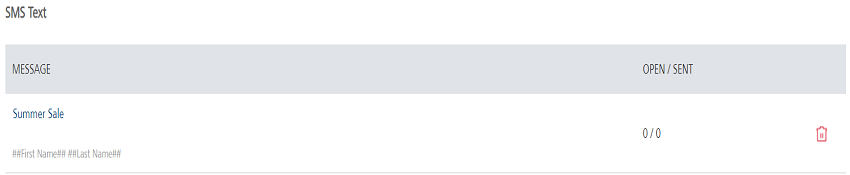
    
    The **Compose SMS Message** window appears. The **Compose SMS Message** window displays all fields that are used to add the SMS message.
    
    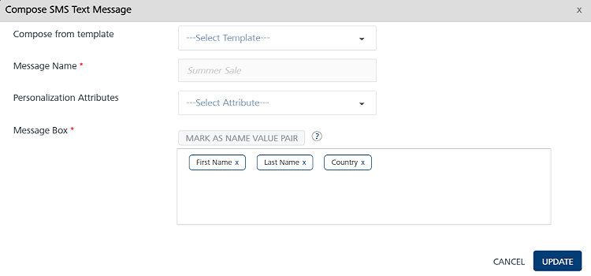
    
2.  You can update the following fields:
    
    | SMS Message Element | Description | Modification Allowed |
    | --- | --- | --- |
    | Copy from Template | SMS message template | Yes |
    | SMS Message Name | SMS message name | No |
    | Personalization Attributes | There are default personalization attributes: First name, Last name, Email, Mobile number, Country, and State | Yes |
    | Mark as Name Value Pair | A key-value pair is a set of two linked data items: a key, which is a unique identifier for some item of data, and the value, the data | Yes |
    | Message Box | SMS message box. | Yes |
    
3.  Click **Cancel** if you do not want to save the updates. The system closes the window without saving any updates.
4.  Click **Update** to continue.
    
    The updated SMS message appears in the **SMS Message** list-view on the **View Event** page.
    

Deleting an SMS Message
-----------------------

As an administrator, you can delete any SMS message.

To delete an SMS message, follow these steps:

1.  To remove an SMS, click the **Delete** button next to **SMS Names.**
    
    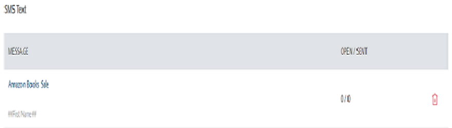
    
    The **Confirm Delete** dialog box appears asking if you want to delete the event message.
    
2.  Click **Cancel**. The **Confirm Delete** dialog box closes without deleting any SMS message.
3.  Click **Ok** to continue. The SMS message is removed from the list-view.
