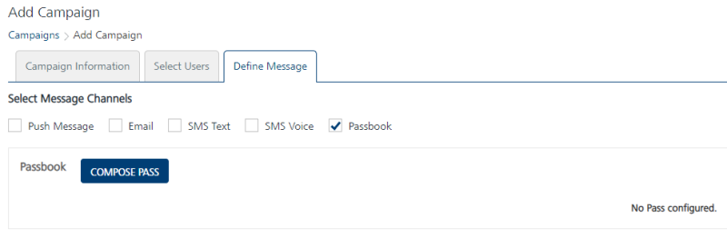
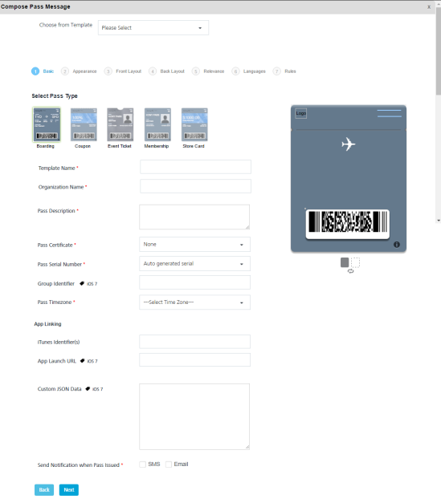
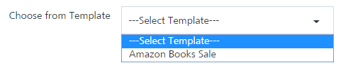
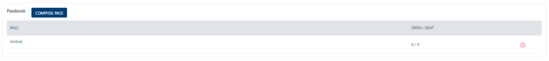

                            

Passbook
========

Passbook notifications can be used to send event tickets.  You can perform the following tasks from the **Add Event** > **Define Message** section:

*   [Adding a Passbook Message](#adding-a-passbook-message)
*   [Modifying a Passbook Message](#modifying-a-passbook-message)
*   [Deleting a Passbook Message](#deleting-a-passbook-message)

Adding a Passbook Message
-------------------------

To compose a Passbook message for an event, follow these steps:

1.  **Select Message Channels**: Select the type of notification as **Passbook**.
    
    The **Passbook Message** grid appears. The **Passbook Message** grid includes a passbook label and the **Compose Pass** button to send pass messages. If no pass message is found, the system displays the message: **No pass configured**.  
      
    
    
2.  Click the **Compose Pass** button to compose a new pass message for an event. The **Compose Pass Message** window appears. You can create a pass through the following options:
    
    *   [Compose New Pass](#compose-new-pass)
    *   [Compose from Template](#compose-from-template)
    
    ### Compose New Pass
    
    To compose a new pass, follow these steps:
    
    1.  Based on your requirement, you can create the pass message. To know more about how to create a pass message, see [Adding a Passbook Template.](../PassBook_Template/Passbook_Template.md#dding_a_Passbook_Template)
        
        
        
        ### Compose from Template
        
        1.  **Creating from existing template**: Select the required template from the **Choose from Template** drop-down list. The selected **Pass Type Template** appears on the screen.
            
            
            
            Based on your requirement, you can update the existing template. To know more about how to update an existing template, refer to [Adding a Passbook Template](../PassBook_Template/Passbook_Template.md#dding_a_Passbook_Template)
            
3.  Click the **Cancel** button to close the window. The system displays the **Add Event** screen.
4.  Click the **Save** button to save the settings. The newly added pass appears in the pass list-view on the **Add Event** page.
    
    
    

Modifying a Passbook Message
----------------------------

You can manage passbook messages, such as view or edit a passbook message details. The **View Event** page contains the following details:

  
| Pass Message Element | Description |
| --- | --- |
| Message | Displays the pass message details |
| Open/Sent | Displays the number of pass messages opened or sent |
| Delete button | The button helps you delete a pass message |
| Cancel button | The button helps you to cancel changes in an event |
| Save button | The button helps you save the updated event |

To view or modify a passbook message, follow these steps:

1.  On the **View Campaign** screen, under the **Pass** column, click the required pass message name in the list-view.
    
    
    
    The **Compose Pass Message** window appears.
    
2.  Based on your requirements, do the necessary changes. For more details, refer to [Modifying a Passbook Template.](../PassBook_Template/Passbook_Template.md#Modifyin)
3.  Click the **Cancel** button to close the window. The system displays the **View Event** page.
4.  Click **Update**. The updated pass message appears in the pass message list-view on the View Event page.

Deleting a Passbook Message
---------------------------

As an administrator, you can delete a pass message.

To delete a passbook message, follow these steps:

1.  To remove a passbook, select the **Delete** button next to the pass message name.
    
    The **Confirm Delete** dialog box appears asking if you want to delete the selected event message.
    
    
    
2.  Click **Cancel**. The **Confirm Delete** dialog box closes without deleting any pass message.
3.  Click **Ok** to continue. The pass message is removed from the list-view.
