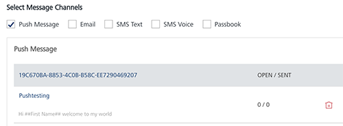

                           

Deleting a Push Message
=======================

As an administrator, you can delete any push message as required.

To delete a push message, follow these steps:

1.  Select the delete icon next to the message name.
    
    
    
2.  The **Confirm Delete** dialog box appears, asking if you want to delete the selected event message.
3.  Click **Cancel**. The **Confirm Delete** dialog box closes without deleting any push message.
4.  Click **Ok** to continue. The push message is removed from the list-view.
