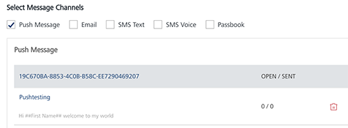

                           

Deleting a Push Message
=======================

As an administrator, you can delete any push message as required.

To delete a push message, follow these steps:

1.  To remove an SMS, select the Delete button next to Message name(s).
    
    
    
2.  .The Confirm Delete message appear, asking if you want to delete both the first message and the repeat message.
3.  Click **Cancel**. The Confirm Delete dialog closes without deleting any push message.
4.  Click **Ok** to continue.
5.  The push message is removed from the grid view.
    
    > **_Important:_** If you delete the first message, the first message and the repeat message are deleted. If you delete the repeat message, only the repeat message is deleted.
