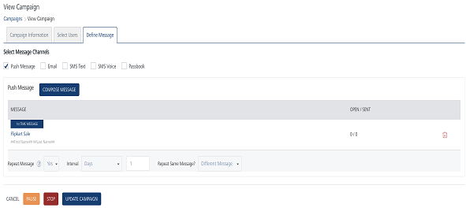
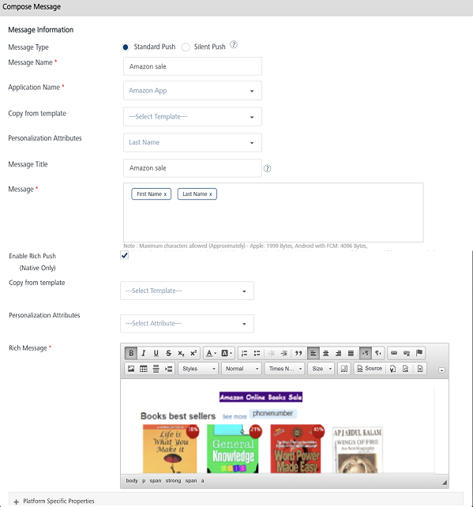

                            

Modifying a Push Message
========================

This feature helps you to manage and modify push message details. For example, you want to modify the message name or the associated application with the push message.The View Campaign page contains the following details:

  
| Push Message Element | Description |
| --- | --- |
| Compose Message button | You can compose a new push message |
| Message | This column displays the push message details |
| Open/Sent | This column displays the number of pushes opened or sent |
| Delete button | Click the Delete button to delete a push message. |
| Pause button | Click the Pause button to pause a campaign |
| Stop button | Click the Stop button to stop a campaign. |
| Cancel button | Click the Cancel button, if you do not want to save the changes in a campaign. |
| Update button | Click the Update button to update a campaign |

To modify a push message, follow these steps:

1.  In the **View Campaigns** screen, click the required push message under the **Push Message** column.
    
    
    
2.  The **Compose Campaign** window appears. The **Compose Campaign** window displays all fields that you have used while adding the push message details.
    
    
    
3.  Based on your requirement, you can update the following details:
    1.  **Message Name**: You cannot update the message name.
    2.  **Application Name**: You can select a new app from the Application Name drop-down list.
    3.  **Personalization Attributes**: You can add new personalization attributes from the Personalization Attributes drop-down list. The new attributes are appended with the already existing attributes.
    4.  **Message Title**: Based on your requirement, you can update the message title.
    5.  **Compose from Template**: You can select a new template from Compose from Template drop-down list.
    6.  **Message Box**: Message Box displays the selected personalization attributes and push message if any.
    7.  **Enable Rich Push**: Based on your requirement, you can select or deselect already existing rich content from the push message. If required, you can select a new rich push template from the copy from template drop down list and add a new rich push message in the rich message box.
    8.  **Platform Specific Properties**: Based on your requirement, you can add or remove platform specific properties.
4.  If you do not want to update details, then click **Cancel** to close the window
5.  To update the details, click **Update**.
    
    The updated push message appears in the push message grid view.
    
    > **_Note:_** You can cancel, pause, stop and update a campaign from the View Campaign page.
